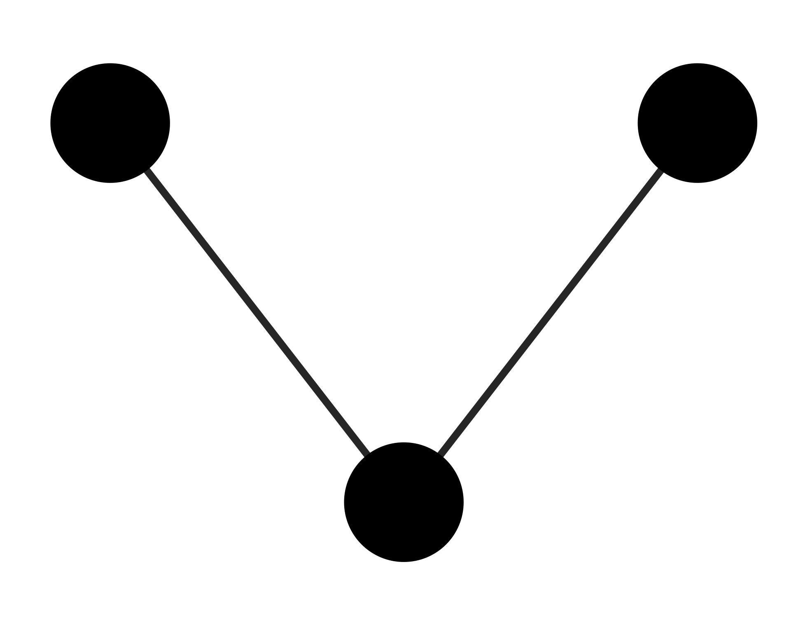
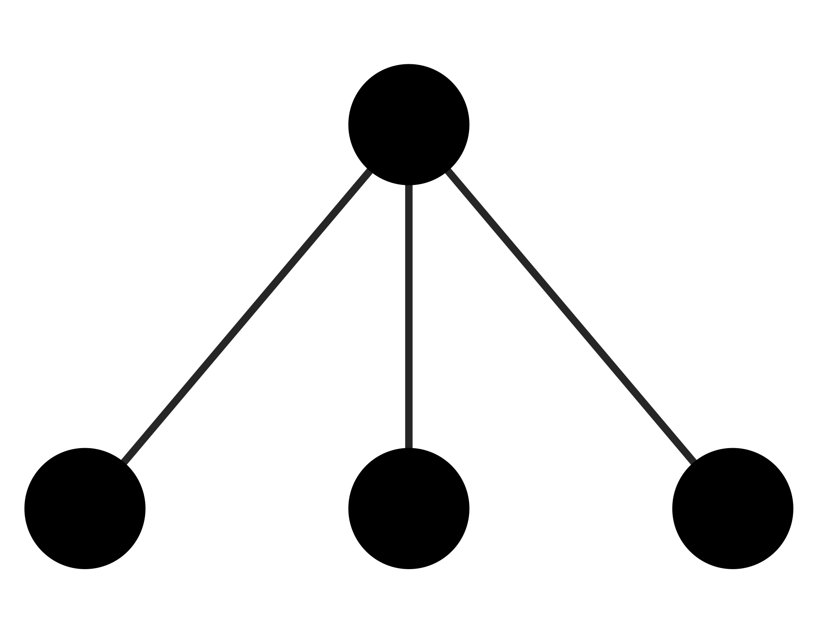
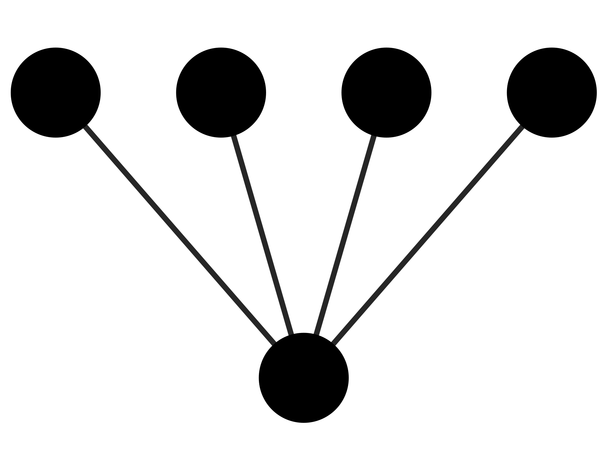
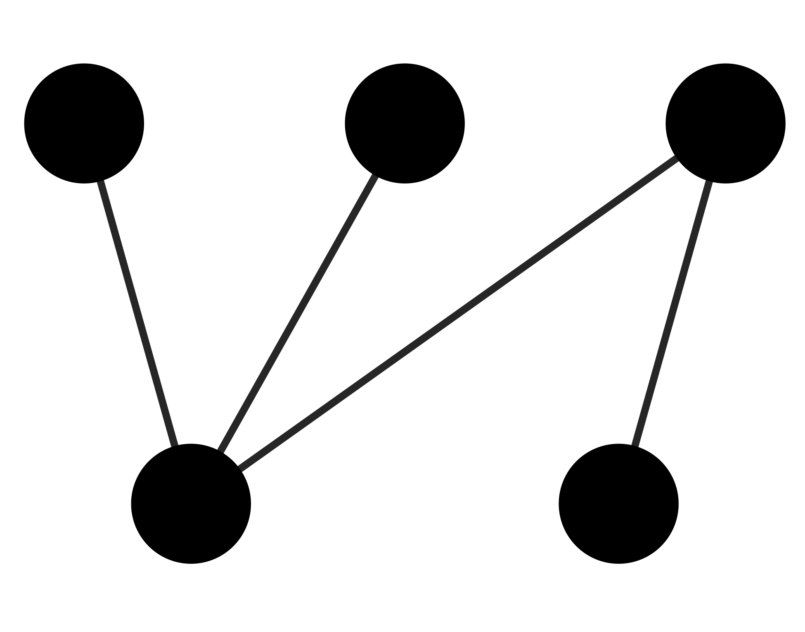
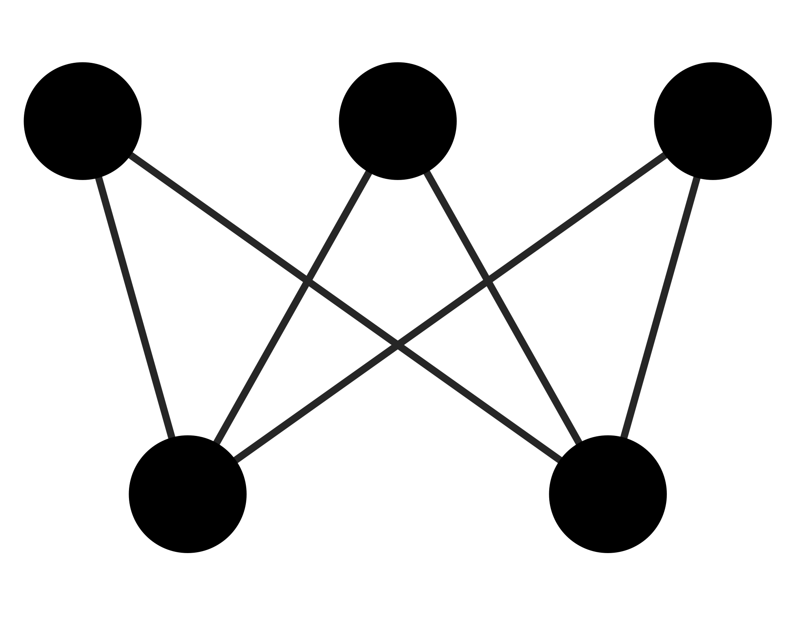
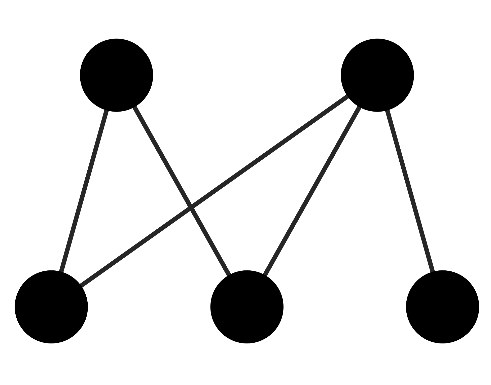

**Jose B. Lanuza^1,2^** \| **Alfonso Allen-Perkins^2,3^** \| **Ignasi Bartomeus^2^**

1 School of Environmental and Rural Science, University of New England, Armidale, New South Wales 2350, Australia.

2 Estación Biológica de Doñana (EBD-CSIC), E-41092 Seville, Spain.

3 Departamento de Ingeniería Eléctrica, Electrónica, Automática y Física Aplicada, ETSIDI, Universidad Politécnica de Madrid, 28040 Madrid, Spain.

\captionsetup[table]{labelformat=empty}

```{r setup, include=FALSE}
knitr::opts_chunk$set(echo = TRUE)
```

# Abstract

\singlespacing

Ecological processes leave distinct structural imprints on the species interactions that shape the topology of animal-plant mutualistic networks. Detecting how direct and indirect interactions between animals and plants are organised is not trivial since they go beyond pairwise interactions, but may get blurred when considering global network descriptors. Recent work has shown that the meso-scale, the intermediate level of network complexity between the species and the global network, can capture this important information. The meso-scale describes network subgraphs representing patterns of direct and indirect interactions between a small number of species, and when these network subgraphs differ statistically from a benchmark, they are often referred to as "network motifs". Although motifs can capture relevant ecological information of species interactions, they remain overlooked in natural plant-pollinator networks. By exploring 60 empirical plant-pollinator networks from 18 different studies with wide geographical coverage, we show that some network subgraphs are consistently under- or over-represented, suggesting the presence of worldwide network motifs in plant-pollinator networks. In addition, we found a higher proportion of densely connected network subgraphs that, based on previous findings, could reflect that species relative abundances are the main driver shaping the structure of the meso-scale on plant-pollinator communities. Moreover, we found that distinct subgraph positions describing species ecological roles (e.g., generalisation and number of indirect interactions) are occupied by different groups of animal and plant species representing their main life-history strategies (i.e., functional groups). For instance, we found that the functional group of 'bees' was over-represented in subgraph positions with a lower number of indirect interactions in contrast to the rest of floral visitors groups. Finally, we show that the observed functional group combinations within a subgraph can not be retrieved from their expected probabilities (i.e., joint probability distributions), indicating that plant and floral visitor associations within subgraphs are not random either. Therefore, our results highlight the presence of common network motifs in plant-pollinator communities that are formed by a non-random association of plants and floral visitors functional groups.

Keywords: pollinators, plant-pollinator networks, plant-pollinator interactions, network motifs, indirect interactions, floral visitors

\doublespacing

\newpage

# Introduction

Ecological communities are formed by a plethora of interacting species that form networks of interactions. Because of the tremendous complexity of these ecological networks, species interactions are generally condensed in metrics that summarise this information [@guimaraes2020]. Plant-pollinator interactions are no exception, and they are often studied with indices that aggregate the information at the network (macro-scale) and species level (micro-scale). For example, plant-pollinator network level approaches have identified common invariant structural properties across mutualistic networks, including a degree distribution that decays as a truncated power law [@jordano1987], nestedness [@bascompte2003], or modularity [@olesen2007]. In addition, the local species position within the network can define its degree of selectiveness [@bluthgen2006] or its role in connecting the rest of the community [@olesen2007]. Despite the unquestionable progress with the use of these metrics at both network and species level, condensing complex information into a single metric implies the loss of relevant ecological information that obscures the understanding of species interactions [@cirtwill2018; @simmons2019].

Indirect interactions, the mediated effect between two species by a third species, are ubiquitous in natural systems [@strauss1991; @holt1994; @wootton1994] and play a key role in shaping community dynamics [@werner2003; @walsh2013]. Some of the most studied indirect interactions are the ones caused by trophic cascades with consumer-resource interactions [@abrams1996; @schmitz2001]. In fact, previous studies focus on antagonistic interactions and mutualistic interactions are often overlooked [@knight2005]. On the contrary, plant-pollinator research has traditionally investigated direct interactions but neglected indirect effects such as competitive or facilitative processes between plants for pollinators [@moeller2004; @sargent2008; @carvalheiro2014]. Conventional analytical tools in bipartite networks often discard relevant information about indirect interactions by condensing the information into single indices either at species or network level [@cirtwill2018; @simmons2019]. However, as previously explored with three species modules in unipartite food webs [@allesina2008; @stouffer2010], the emergent framework of bipartite subgraphs has proven to be a powerful analytical tool to better understand plant-pollinator community dynamics by capturing both direct and indirect effects [@simmons2019]. These network subgraphs that constitute the meso-scale are often referred to as the building blocks of the network and when their numbers occur at higher frequencies than in randomised networks, those are generally defined as 'network motifs' [@milo2002]. Indeed, the analysis of motifs in simulated plant-pollinator networks has revealed that the different drivers that govern species interactions (e.g., species abundances versus trait-matching) can lead to different patterns of indirect effects [@simmons2020]. However, the global patterns of indirect interactions in real plant-pollinator networks and their ecological consequences remain unexplored (e.g., over- and under- represented network subgraphs).

By linking the structural properties of the meso-scale with the species' ecology we can advance in our understanding on the determinants of species interactions. For instance, different motifs can have different ecological meanings [@simmons2019] and the position within a motif can determine the species' functional role [@stouffer2012; @baker2015; @cirtwill2018b]. Yet, our understanding of the ecological implications of network motifs in real plant-pollinator networks remains in its infancy. Moreover, it is unclear how the species ecology and life-history traits determine its functional role within the network of interactions [@coux2016]. For example, large pollinators can forage larger distances [@greenleaf2007], deposit greater pollen quantities [@foldesi2021] and handle complex zygomorphic flowers in comparison with small pollinators that are restricted to lower floral complexity [@gong2009]. Despite these obvious differences in pollinator behaviour, how contrasting species' ecology translates into different network motifs is still poorly known. Similarly, recent empirical findings indicate that the meso-scale is the best descriptor of plant reproductive success [@allen2021], but little is known about how plants' reproductive strategies shape their position within the network of interactions. Although some studies have evaluated plant reproductive strategies in plant-pollinator networks [@tur2013; @lazaro2020], this is an often overlooked aspect in a community context [@devaux2014] and rarely incorporated into plant-pollinator network studies. Hence, exploring how the main plant and floral visitor life-history strategies integrate with the emergent framework of network motifs could help to progress knowledge on the ecological processes that shape plant-pollinator interactions.

Here we evaluate the interaction patterns of the meso-scale and its ecological implications in plant-pollinator networks with the help of 60 empirical networks from 18 different studies distributed across 14 different countries. For this, plants and pollinators were divided into functional groups that summarise their main life-history strategies and the different networks were split into all their subgraph elements up to five nodes. First, based on previous knowledge showing the non random assembly of macro-scale mutualistic networks [@bascompte2003] and food webs [@dunne2002], we test the hypothesis that the building blocks that constitute the meso-scale in plant-pollinator networks have a non-random structure of interactions with over- and under-represented subgraphs (i.e., motifs) that represent contrasting ecological roles. Second, because species relative abundances (i.e., neutral effects) are one of the main drivers of network macro-struture [@krishna2008; @suweis2013; @bartomeus2016], we hypothesise that neutral effects may also govern the interaction patterns of the meso-scale in plant-pollinator networks. Finally, we explore if plants and pollinators functional groups are associated with subgraph positions that imply distinct ecological roles and if there are over- and under-represented functional group combinations within the different network subgraphs.

# Methods

**Overview**

To investigate the structure of the meso-scale in plant-pollinator networks, we gathered published plant-pollinator networks with worldwide distribution. Then, we classified the different plant and floral visitor species from these networks into functional groups that summarise their main life-history strategies. We calculated the normalised subgraph frequencies and investigated if these frequencies are similar or not to the ones expected by chance with the help of null models. Then, for each group of plants and floral visitors we investigated the ecological implications of their overall representation on the different subgraph positions, by comparing, on the one hand, the observed (normalised) frequencies of each group in the different subgraph positions with the frequencies of their simulated counterparts, and, on the other hand, the differences among groups per subgraph position in terms of their number of indirect interactions and specialisation. Finally, to understand if the different functional group combinations within a subgraph are structured, we compare if the observed functional group combinations from empirical networks can be retrieved from the joint probability distribution of the expected frequencies of the different plant and floral visitor groups within network subgraphs.

**Plant-pollinator studies**

We have compiled 60 plant-pollinator networks from 18 different studies (Table S1). All studies sampled plant-pollinator interactions in natural systems in a single flowering season and were selected based on wide geographical coverage (Fig. S1) and presence of interaction frequency as a measure of interaction strength. In total, there were 503 plant species, 1,111 floral visitors species and 6,248 pairwise interactions registered. For ease of data manipulation, plant and floral visitor species names were standardised with the help of the R package *taxize* version *0.9.99* [@chamberlain2020].

**Plant and floral visitor functional groups**

First, plant species were grouped through hierarchical clustering into the optimal number of functional groups that summarises the main plant reproductive strategies. For this, we used the plant trait dataset compiled in @lanuza2021 that consisted also of plant species that belonged to the same plant-pollinator networks plus some additional meta-networks not considered here. This dataset comprised a total of 1,506 plant species including the 503 species considered in this study (Table S2). Because most of these plant species are likely to benefit from animal pollination, we used reproductive traits relevant to understand the different plant reproductive strategies and their interactions with pollinators. After excluding traits with a high percentage of missing values (over 30$\%$), we ended up with 8 floral, 3 reproductive biology and 3 plant morphology traits (see Table S3 for a list of all traits). Floral traits included those associated with the size, form and number of floral organs (e.g., style length or ovule number). Reproductive biology traits described the reproductive system of the plant (e.g., mating and compatibility systems) and plant morphology traits were associated with the size and form of the plant (i.e., plant height, lifespan and life form). After an extensive search for each plant species on several different resources (e.g., plant databases, online floras, books, journals and images), over 80% of the cells of the whole dataset were filled. Thus, to avoid the loss of species with trait missing values, missing trait data was imputed as detailed in @lanuza2021.

We opted to calculate the plant functional groups within a larger set of species because of the higher accuracy when delimiting functional groups with that many variables and species [@dolnicar2014]. To feed the clustering analysis, we calculated the distance between the different qualitative and scaled quantitative variables with Gower distance [@gower1971]. For this, we used the function *gowdis* with method *ward.D2* from the *FD* package version *1.0-12* [@laliberte2014]. Finally, we conducted hierarchical clustering with the function *hclust* from the *R* stats package version *4.0.5* and calculated the optimal number of clusters with the function *kgs* from the *maptree* package version *1.4-7* [@white2009].

Second, floral visitors were aggregated into taxonomic groups (hereafter referred to as functional groups) based on taxonomic rank as done similarly in other plant-pollinator studies [@fenster2004; @ollerton2009]. We opted to divide floral visitors on the taxonomic rank level and not with functional traits because the main orders of floral visitors differed in form and behaviour and had lower superior taxonomic complexity (i.e., floral visitors had 6 orders versus plants that had 38). Thus, this allowed us to group floral visitors into functional groups that represented approximately the main life-history strategies of the possible pollinators: (i) bees (Hymenoptera-Anthophila), (ii) non-bee Hymenoptera (Hymenoptera-non-Anthophila), (iii) syrphids (Syrphidae-Diptera), (iv) non-syrphids-Diptera, (v) Lepidoptera and (vi) Coleoptera. However, a minor set of species belonged to other functional groups that were considered in analyses but not discussed further because of their low representation in the full set of networks (3.55$\%$ of the total interactions recorded). These taxonomic groups were 'lizards', 'birds' and 'other insects'. This last functional group was formed by a mix of uncommon insect taxa on the full set of networks.

**Overall network subgraphs patterns**

Following previous work [@simmons2019; @simmons2020], we broke down the plant-pollinator networks into their constituent network subgraphs that can capture both direct and indirect interactions. Prior to analyses, we turned the quantitative networks into qualitative (or binary) ones, where interactions are present or absent. This approach was preferred since quantitative subgraph analyses have been developed just recently and more work is needed to fully understand and interpret the information that they can convey [@simmons2020]. All analyses were run considering singletons (species with only one interaction detected) but we conducted a second exploration without singletons (64.98$\%$ of interactions) to evaluate the effect of rare species on the observed patterns. Results without singletons are qualitatively consistent and are not further discussed in the main text (Figs S2 and S3).

We calculated the frequency of all subgraphs up to five nodes (17 different subgraphs in total; see Fig. 1) for each empirical network, by using the *bmotif* package version *2.0.2* [@bmotifsimmons2019]. We focused exclusively on subgraphs up to five nodes in our analyses for computational reasons and for the ease of visualization and interpretation of a reduced set of less complex network structures. Throughout the entire manuscript, floral visitors occupy the top nodes of the different network subgraphs and plants the bottom ones. To control for variation in network size, subgraph frequencies were normalised as a proportion of the total number of subgraphs within each subgraph class (i.e., 2-species, 3-species, 4-species and 5-species network subgraphs). In addition, we excluded 2-species (or 2-nodes) subgraphs from our analyses because its normalised frequencies would always equal one. Note that the aim is not comparing different networks, which may differ in sampling effort, but correctly describing the structure of each individual network. Like @simmons2020, we classified the different subgraphs by their average path length (mean number of links between all pairs of nodes) into four different groups: (i) complete or strong ($\overline{x} = 1.38$), (ii) fan or medium-strong ($\overline{x} = 1.48$), (iii) assymmetric complete or medium-weak ($\overline{x} = 1.60$) and (iv) core-peripheral or weak ($\overline{x} = 1.85$), where $\overline{x}$ represents the mean of the average path length across subgraphs within the same group. In general terms, plant and floral visitor groups on more densely connected network subgraphs (e.g., complete or fan) will experience lower number of indirect interactions in contrast to groups on less densely connected structures (e.g., medium-weak or weak).

```{r, echo=FALSE, message=FALSE, cache=FALSE, fig.pos="t", warning=FALSE,out.width="75%",fig.align="center", fig.cap="\\textbf{Figure 1.} Adapted figure of Simmons et al., (2019). All possible network subgraphs from two to five species in bipartite networks grouped by the different subgraph classes (2-species, 3-species, 4-species and 5-species). There are a total of 17 possible subgraphs with 46 different positions denoted within each node. The different subgraphs are aggregated by the broad indirect interaction structures they represent on four different groups (strong, medium-strong, medium-weak and weak). For each group, we show in the legend the mean value of the average path length of all subgraphs within it. The different path length groups range from densely connected network structures (strong subgraphs where all possible interactions are realised and the mean path length is minimum) to weakly connected ones (weak subgraphs where the mean path length is maximum).", fig.width=10,fig.height=8}
library(tidyverse)
library(RColorBrewer)
source("../../Scripts/Scripts_Alfonso/plot_motif_positionsV2.R")

motif_number <- 1
p1 <- plot_motif_positions(motif_number) +
geom_point(aes(color = as.factor(label)),size=10,color = "grey90")+
geom_text(aes(x, y , label = label),size=3)

motif_number <- 2
p2 <- plot_motif_positions(motif_number)+
geom_point(aes(color = as.factor(label)),size=10,color = "mediumaquamarine")+
geom_text(aes(x, y , label = label),size=3)

motif_number <- 3
p3 <- plot_motif_positions(motif_number)+
geom_point(aes(color = as.factor(label)),size=10,color = "mediumaquamarine")+
geom_text(aes(x, y , label = label),size=3)

motif_number <- 4
p4 <- plot_motif_positions(motif_number)+
geom_point(aes(color = as.factor(label)),size=10,color = "mediumaquamarine")+
geom_text(aes(x, y , label = label),size=3)

motif_number <- 5
p5 <- plot_motif_positions(motif_number)+
geom_point(aes(color = as.factor(label)),size=10,color = "lightcoral")+
geom_text(aes(x, y , label = label),size=3)

motif_number <- 6
p6 <- plot_motif_positions(motif_number) +
geom_point(aes(color = as.factor(label)),size=10,color = "goldenrod2")+
geom_text(aes(x, y , label = label),size=3)

motif_number <- 7
p7 <- plot_motif_positions(motif_number)+
geom_point(aes(color = as.factor(label)),size=10,color = "mediumaquamarine")+
geom_text(aes(x, y , label = label),size=3)

motif_number <- 8   
p8 <- plot_motif_positions(motif_number)+
geom_point(aes(color = as.factor(label)),size=10,color = "mediumaquamarine")+
geom_text(aes(x, y , label = label),size=3)

motif_number <- 9
p9 <- plot_motif_positions(motif_number)+
geom_point(aes(color = as.factor(label)),size=10,color = "lightcoral")+
geom_text(aes(x, y , label = label),size=3)

motif_number <- 10
p10 <- plot_motif_positions(motif_number)+
geom_point(aes(color = as.factor(label)),size=10,color = "lightcoral")+
geom_text(aes(x, y , label = label),size=3)

motif_number <- 11
p11 <- plot_motif_positions(motif_number)+
geom_point(aes(color = as.factor(label)),size=10,color = "skyblue")+
geom_text(aes(x, y , label = label),size=3)

motif_number <- 12
p12 <- plot_motif_positions(motif_number)+
geom_point(aes(color = as.factor(label)),size=10,color = "goldenrod2")+
geom_text(aes(x, y , label = label),size=3)

motif_number <- 13
p13 <- plot_motif_positions(motif_number)+
geom_point(aes(color = as.factor(label)),size=10,color = "lightcoral")+
geom_text(aes(x, y , label = label),size=3)

motif_number <- 14
p14 <- plot_motif_positions(motif_number)+
geom_point(aes(color = as.factor(label)),size=10,color = "lightcoral")+
geom_text(aes(x, y , label = label),size=3)

motif_number <- 15
p15 <- plot_motif_positions(motif_number)+
geom_point(aes(color = as.factor(label)),size=10,color = "skyblue")+
geom_text(aes(x, y , label = label),size=3)

motif_number <- 16
p16 <- plot_motif_positions(motif_number)+
geom_point(aes(color = as.factor(label)),size=10,color = "goldenrod2")+
geom_text(aes(x, y , label = label),size=3)

motif_number <- 17
p17 <- plot_motif_positions(motif_number)+
geom_point(aes(color = as.factor(label)),size=10,color = "mediumaquamarine")+
geom_text(aes(x, y , label = label),size=3) 


library(patchwork)

p <- (p1 & ylab("2 species")| p2 & ylab("3 species") | p3 ) /
(p4 & ylab("4 species")| p5 | p6 | p7) / 
(p8  & ylab("5 species")| p9 | p10 | p11 | p12) /
(p13 & ylab("5 species")| p14 | p15 | p16 | p17) &
theme(axis.title.y = element_text(color="black", size=14, face="bold"))


#Create custom legend
a <- c(1,2,3,4)
b <- c(1,2,3,4)
c <- c("a","b", "c", "d")
abc <- data.frame(a,b,c)
p1 <- ggplot(abc, aes(x=a,y=b, color=c))+geom_point() + theme_bw() + 
  scale_colour_manual(name = 'Path length classification', 
                      values =c(a= 'goldenrod2',b='mediumaquamarine',
                                c='skyblue', d='lightcoral'), 
                      labels = c(a='Strong \n mean path length = 1.38', 
                                 b='Medium-strong \n mean path length = 1.48',
                                 c='Medium-weak \n mean path length = 1.60',
                                 d='Weak \n mean path length = 1.85'))+
theme(legend.position="bottom")+ guides(colour = guide_legend(override.aes = list(size=8),title.position="top", title.hjust = 0.5))

legend <- cowplot::get_legend(p1+ theme(legend.position = "bottom",legend.text = element_text(size=10), legend.title = element_text(size=12, 
face="bold"),legend.box.background = element_rect(color="black", size=2)))

cowplot::plot_grid(p, legend, ncol = 1, rel_heights = c(12, 1.8))

```

To assess the significance of the observed frequencies, we created 1,000 simulated networks for each binary network using the *nullmodel* function and the *vaznull* model in the *bipartite* package version *2.14* [@dormann2009]. Generated networks had the same number of plants and floral visitors, as well as the same connectance of their corresponding empirical networks. We discarded null models with more constraints (e.g., constraining for species degree) because the permutations did not generate sufficient variability and provided highly similar or identical networks to the original ones. After extracting the subgraph frequencies from the simulated networks, for each subgraph type and empirical network, we calculated the percentage of simulated networks whose frequencies were smaller than the ones observed, that is, we estimated the percentile of the observed subgraph frequencies. Subgraphs whose percentile is close to 0 or 100 are under- or over-represented in empirical networks, respectively, and indicate the presence of network motifs as they differ statistically from the network structures generated with simulated networks. To summarise general patterns across networks, we used an intercept-only linear mixed model (LMM) per subgraph with the help of the *lme4* package version *1.1-21* [@bates2015], where the response variable was the observed subgraph percentile per network. Note that as we are only interested in modelling the intercept value, no predictors were specified. In these models, we used the study identifiers in Table S1 as a random intercept. By doing so, we obtained estimates of the average subgraph frequency, but controlling for the variation at the study level.

**Over- and under-represented functional groups on subgraph positions**

We calculated which plant and floral visitor functional groups were over- or under-represented in the different subgraph positions by comparing position frequencies of empirical networks with those of their corresponding simulated counterparts. To estimate the position frequencies of each plant and floral visitor group in a given network, we added the frequencies of those species that belong to the same group, and then, we normalised the resulting frequencies by dividing them by the total number of times that a corresponding group appears in any position within the same subgraph size class. Then, we calculated the percentile of the observed position frequencies for each functional group and network, just like we did with subgraph frequencies. To outline the general patterns of position frequencies across networks and groups, we fit a LMM per subgraph position, where the response variable was the observed position percentile per network. We used the group identifier as an explanatory variable and the study identifiers as a random intercept. Hence, we assessed the average subgraph frequency per species group, after controlling for the variation at the study level. Finally, we visualised over- and under-representation of plant and floral visitor groups on the different subgraph positions with the help of the *ComplexHeatmap* package version *2.6.2* [@gu2016].

To understand if the different plant and floral visitor functional groups are associated with subgraph positions that represent different network roles, we characterised the roles of each subgraph position for the different functional groups in terms of their specialisation and number of indirect interactions. To that end, we calculated the specificity of each subgraph position following @poisot2015 as $s_i = (L - l_i) / (L - 1)$, where $L$ is the total number of groups and $l_i$ the number of interaction partners of the group $i$ in a given subgraph. Values of the vector $si$, range between 1, complete specialisation (1 partner within the subgraph) and 0 complete generalism (all possible partners within the subgraph). Then, because all nodes within a motif are connected, we calculated the number of indirect interactions ($\theta_i$) for each motif position as $\theta_i=m_i-k_i-1$, where $m_i$ is the total number of nodes in a given motif, and $k_i$ represents the degree of the corresponding motif position, that is, the total number of links connected to such position. Thus, we considered all possible indirect interactions for each position. Finally, we analysed in a single model how specialisation and the number of indirect interactions were associated with the observed percentiles for each trophic guild and subgraph position. For this, we fitted again a LMM model with the help of the *lme4* package, where we considered specialisation and number of indirect interactions as response variables with the interaction by plant and floral visitor group for both response variables. Further, we considered as random factor subgraph position nested within study system.

**Over- and under-represented functional group combinations of subgraphs**

Finally, we studied which combinations of plant and floral visitor functional groups tend to appear together within the same subgraphs (up to five nodes). That is, which combinations are over- or under-represented. This analysis used 57 out of the 60 networks available due to computational limitations to identify all the nodes in the subgraphs of the three networks with the highest number of links. To do so, for each of the 53,250 possible subgraph combinations, we estimated the observed and the expected probability of finding those combinations in empirical networks, respectively. Then, we determined whether the observed probabilities are likely to come from the expected probabilities or not. To calculate the observed probability ($p_i^O$) of the different groups within a subgraph $i$ (e.g., subgraph 3, 'bee' + 'bee' + 'selfing herbs'), we divided the number of times that $i$ appears in our set of empirical networks ($n_i^O$) by the sum of the number of times that each possible combination appeared: $p_i^O = n_i^O / \sum_{k=1}^{53,250} n_k^O$. To estimate the expected probability ($p_i^E$) of a given subgraph combination $i$, we assumed that the probability of finding a given functional group $x$ in the position $\alpha$ is independent of the probabilities associated with other positions and groups in that subgraph. Therefore, the expected probability ($p_i^E$) of the subgraph combination $i$ is given by the product of the probabilities of its constituents, i.e., $p_i^E = \prod _{(x,\alpha )\in i} p_i(x,\alpha)$, where $p_i(x,\alpha)$ is the probability of finding a given functional group $x$ in the position $\alpha$ of $i$. Then, by controlling for the variation at the network level with an LMM (see below), we calculated the average number of times that the functional group $x$ appears in the position $\alpha$ (denoted as $n_i(x,\alpha)$). To obtain the expected probability $p_i(x,\alpha)$, we divided the number of times that the group $x$ appears in the position $\alpha$ by the the total number of times that any group was observed in that position (that is, $p_i(x,\alpha) = n_i(x,\alpha)/\sum_{k}n_i(k,\alpha)$). The average number of times that the group $x$ appears in the position $\alpha$ ($n_i(x,\alpha)$) was calculated with a LMM for each position, where the response variable was the number of times that a group was observed at a given position in each real-world network, the explanatory variable was the group identifier, and the random intercept was given by network identifiers nested within the study identifiers.

Once we obtained $p_i^O$ and $p_i^E$, we used a simulation approach to determine whether the former is likely to come from the latter or not. This approach was preferred since the large number of possible subgraph combinations and the small probabilities for some of them advise against using an exact test of goodness-of-fit or a Chi-square one. Specifically, we created 1,000 random samples with repetition of possible subgraph combinations, where each sample contained 10 million elements and, for each combination, the probability of being selected was equal to its expected probability. From those random samples, we extracted the mean and the standard deviation of the expected probability of $i$, denoted as $E\left [ p_i^E \right ]$ and $\sigma\left [ p_i^E \right ]$, respectively, and calculated the z-scores of $p_i^O$ as $z_i^O = \left ( p_i^O - E\left [ p_i^E \right ] \right )/\sigma \left [ p_i^E \right ]$, for those motif combinations with $p_i^O > 0$. According to the usual interpretation of z-scores, combinations with $z_i^O > 1.96$ are over-represented, whereas those with $z_i^O < -1.96$ are under-represented, at the 95$\%$ confidence level. Notice that we focused on combinations with $p_i^O > 10^{-7}$ because we do not have enough numerical resolution to accurately detect whether combinations that took place only once are under-represented (due to the limited size of our random samples).

All analyses and data manipulation were conducted in R *version 4.0.5* [@R]. In addition, all model diagnostics were conducted with the help of the *Dharma* package [@hartig2017] version *0.3.3.0* and model outputs were visualised with the *visreg* package [@breheny2020] version 2.7.0.

# RESULTS

**Plant and floral visitor functional groups**

The hierarchical cluster analysis divided the dataset into five different plant functional groups with different and overlapping characteristics (Figs S4 and S5). The first group referred to as 'selfing herbs' consisted of herbs with hermaphroditic flowers with high levels of autonomous selfing. The second group named 'small outcrossing perennials' had small perennial species with a mix of life forms (i.e., trees, shrubs and herbs) with outcrossing hermaphroditic flowers. The third group referred to as 'self-incompatible perennials with large flowers' comprised perennial species with a mixed of life forms and large self-incompatible hermaphroditic flowers with high number of ovules. The fourth group named 'tall plants with small unisexual flowers' had the tallest species, highest proportion of shrub and tree life forms, dioecious and monoecious breeding systems, small flowers, and the highest numbers of flowers and inflorescences per plant. Finally, the fifth group named 'short-lived outcrossers with long zygomorphic flowers' consisted of small perennial and short-lived herbs with long self-compatible zygomorphic flowers that were unable to self-pollinate.

In total, there were 1,126 species of floral visitors with 6,325 interactions recorded with plants. Most plants interacted with bees (2,256 interactions) and non-syrphid Diptera (1,768) followed by syrphids (845), Lepidoptera (437), Coleoptera (432) and non-bee Hymenoptera (362).

**Overall network subgraphs patterns**

Most network subgraphs were under- or over-represented (close to the 1st and 99th percentile, respectively) in the comparison between empirical and simulated networks (Fig. 2). Network subgraphs 3, 5, 9, 10 and 14 were under-represented in empirical networks, that is, all were close to the 1st percentile and under the 25th percentile. Interestingly, four out of five of these motifs belonged to the largest path length classification (i.e., core-peripheral). In addition, network subgraphs 2, 6, 7, 16 and 17 were over-represented, all over the 75th percentile. In contrast to the under-represented network subgraphs, over-represented subgraphs belonged to the two shortest path length groups (i.e., complete and fan). The remaining network subgraphs (i.e., 4, 8, 11, 12, 13, and 15) were between the 25th and 75th percentile.

```{r, echo=FALSE, message=FALSE, cache=FALSE,  warning=FALSE, fig.width=4.5,fig.height=6.5, fig.cap="**Figure 2.** Comparison of network subgraph frequencies between empirical and simulated networks grouped by average path length (plots a, b, c and d) where $\\overline{x}$ indicates the mean of the average path lengths of all subgraphs within each group (strong, medium-strong, medium-weak and weak). This comparison is shown with the mean percentage of subgraph frequencies in empirical networks that were over the subgraph frequencies of the simulated ones (percentiles). This was done by network (light blue transparent dots) and then averaged for all networks (black dots with error bars that correspond to the standard deviation)."}

library(lme4)
library(nlme)
library(tidyverse)
source("../../Scripts/Scripts_Alfonso/add_study_id.R")
d <- read_csv("../../Data/Csv/Motifs_frequencies_and_null_models/Motifs_frequency_percentile.csv")
d <- add_study_id(d)
#str(d)
#head(d)

#ggplot(d %>% filter(motif != 1), aes(percentil_sizeclass))+
#  geom_histogram(color="black", fill="white")+
#  facet_wrap(~motif)+
#  theme_bw()+
#  labs(x="Sizeclass percentile")
#
# Motifs tend to be over- and under-represensented in real networks

# Mean percentile and SE taking into account the study system
motif_codes <- d %>% filter(motif != 1) %>% # We remove links (motif code: 1)
  select(motif) %>% unique() %>% pull()
motif_means <- tibble(motif = motif_codes)
motif_means$mean <- NA
motif_means$SE <- NA

for(i.motif in 1:length(motif_codes)){
  
  m <- lmer(percentil_sizeclass ~ 1+(1|study_id), #HERE WE NEED STUDY SYSTEM ONLY!! 
            data = subset(d, motif == motif_codes[i.motif]))  
  
  motif_means$mean[i.motif] <- fixed.effects(m) %>% unname()
  motif_means$SE[i.motif] <- sqrt(diag(vcov(m)))
  
}

#Add categories based on path length set by Simmons 2021 et al., Functional Ecology
d$Broad_categories[d$motif==2 | d$motif==7 | d$motif==17 | d$motif==3|d$motif==4|d$motif==8] <- "Fan" 

d$Broad_categories[d$motif==15 | d$motif==11] <- "Medium-weak" 

d$Broad_categories[d$motif==6 | d$motif==16 |  d$motif==12] <- "Strong" 

d$Broad_categories[d$motif==5 | d$motif==9 |  d$motif==14|  d$motif==13|  d$motif==10] <- "Weak" 

#order the categories from short to long path length
d$Broad_categories <- factor(d$Broad_categories, levels = c("Strong", "Fan", "Medium-weak", "Weak"))

#Ffilter out two node motifs
d_1 <- d %>% filter(motif != 1)
#Merge dataframes to bl able to create facets
d_2 <- merge(d_1, motif_means, by="motif")

arr <- list('Strong' = expression(bold(paste("(a) Strong (Complete, ", bar(x), " = 1.38)"))),
             'Fan' = expression(bold(paste("(b) Medium-strong (fan, ", bar(x), " = 1.48)"))), 
             'Medium-weak' = expression(bold(paste("(c) Medium-weak (asymmetric complete, ", bar(x), " = 1.60)"))), 
             "Weak" =expression(bold(paste("(d) Weak (core-peripheral, ", bar(x), " = 1.85)"))))
mylabel <- function(val) { return(lapply(val, function(x) arr[x])) }

library(ggforce) #workaround with ggforce to have facets with same sizes 
library(ggtext)

labels <- c("2" = "*Subgraph 2* " ,
          "3"= "*Subgraph 3* ",
          "4"= "*Subgraph 4* ",
          "5"= "*Subgraph 5* ",
          "6"= "*Subgraph 6* ",
          "7"= "*Subgraph 7* ",
          "8"= "*Subgraph 8* ",
          "9"= "*Subgraph 9* ",
          "10"= "*Subgraph 10* ",
          "11"= "*Subgraph 11* ",
          "12"= "*Subgraph 12* ",
          "13"= "*Subgraph 13* ",
          "14"= "*Subgraph 14* ",
          "15"= "*Subgraph 15* ",
          "16"= "*Subgraph 16* ",
          "17"= "*Subgraph 17* ")
            

p <- ggplot()+geom_point(data = d_2 , aes(y=factor(motif), 100*percentil_sizeclass), shape=21,color="black",fill="azure2",size=1.75, alpha=0.3)+
  geom_errorbar(data = d_2,aes(y = factor(motif), xmin=100*(mean-SE), xmax=100*(mean+SE)), 
                width=0.8,size=0.8,color="black") +theme_bw()+
  geom_point(data = d_2,aes(y = as.factor(motif), x=100*mean), 
             size=2,color="black")+labs(y="Two to five node motifs", x = "Percentile")+
  theme( strip.background = element_blank())+
  theme(strip.text = element_text(face="bold", size=10, hjust=0),
        panel.border=element_rect(color="black",size=1.2))+
  scale_y_discrete(name = NULL,
                   labels = labels) +
  theme(axis.text.y = ggtext::element_markdown())

p + ggforce::facet_col(vars(Broad_categories), scales = 'free', space = 'free',labeller=mylabel)

#Trying to maintain a gradient from low to high in colors

#Fig 1 Should be a dot plot (or forest plot) of the mean +- SE of the 15 motifs.
#NICE! Can we put motifs in Y axes, and % in X?
```

**Over- and under-represented functional groups on subgraph positions**

```{r , include=FALSE}

#SAME SCRIPT AS THE PLOTTING FOR THE HEATMAP BUT I NEED IT HERE TO LOAD THE VARIABLES WITH VALUES ON RESULTS

library(lme4)
library(nlme)
library(tidyverse)
library(stringi)
source("../../Scripts/Scripts_Alfonso/add_study_id.R")

#############################################
# EXTRACT MEAN VALUES
#############################################
all_position_percentiles <- read_csv("../../Data/Csv/Motifs_positions_and_null_models/GF_positions_frequency_percentile.csv")

all_position_percentiles$position <- stri_extract_first_regex(all_position_percentiles$position,
                                                              "[0-9]+") %>% as.numeric()

all_position_percentiles <- add_study_id(all_position_percentiles)
#str(all_position_percentiles)
#head(all_position_percentiles)

list_plants_FG <- as.character(1:10)

plant_position_percentiles_filtered <- all_position_percentiles %>% 
  filter(Node_FG %in% list_plants_FG, !position %in% c(1,2),
         !is.na(expected_freq_its_GF)) #ME DA ERROR
pollinator_position_percentiles_filtered <- all_position_percentiles %>% 
  filter(!Node_FG %in% list_plants_FG, !position %in% c(1,2),
         !is.na(expected_freq_its_GF))

# Plants-------------

# Mean percentile and SE taking into account the study system
plant_codes <- plant_position_percentiles_filtered$position %>% unique()
plant_means <- plant_position_percentiles_filtered %>% select(position,Node_FG) %>% unique()
plant_means$mean <- NA
plant_means$SE <- NA

for(i.pos in 1:length(plant_codes)){
  
  m <- lmer(percentil_its_GF ~ Node_FG + (1|study_id),
            data = plant_position_percentiles_filtered %>%
              filter(position == plant_codes[i.pos]))  
  
  temp <- fixed.effects(m) %>% unname()
  plant_means$mean[plant_means$position == plant_codes[i.pos]] <- c(temp[1],
                                                                    temp[1]+temp[2],
                                                                    temp[1]+temp[3],
                                                                    temp[1]+temp[4],
                                                                    temp[1]+temp[5]) ## to get real means per FG
  temp <- sqrt(diag(vcov(m)))
  plant_means$SE[plant_means$position == plant_codes[i.pos]] <- c(temp[1], 
                                                                  temp[1]+temp[2],
                                                                  temp[1]+temp[3],
                                                                  temp[1]+temp[4],
                                                                  temp[1]+temp[5])
  
}

# Pollinators--------

# Mean percentile and SE taking into account the study system
pollinator_codes <- pollinator_position_percentiles_filtered$position %>% unique()
pollinator_means <- pollinator_position_percentiles_filtered %>% select(position,Node_FG) %>% unique()
pollinator_means$mean <- NA
pollinator_means$SE <- NA
pollinator_means_reordered <- NULL

for(i.pos in 1:length(pollinator_codes)){
  
  m <- lmer(percentil_its_GF ~ Node_FG + (1|study_id), #HERE WE NEED STUDY SYSTEM ONLY!! 
            data = pollinator_position_percentiles_filtered %>%
              filter(position == pollinator_codes[i.pos]),
            control = lmerControl(optimizer ="Nelder_Mead")) # I changed the optimizer because motif 8 (i.pos = 3) caused convergence problems, max gradient = 0.0022 > 0.002.
  
  temp <- fixed.effects(m) %>% unname()
  pollinator_means_aux <- pollinator_means[pollinator_means$position == pollinator_codes[i.pos],] %>% arrange(Node_FG)
  
  pollinator_means_aux$mean <- c(temp[1],
                                 temp[1]+temp[2],
                                 temp[1]+temp[3],
                                 temp[1]+temp[4],
                                 temp[1]+temp[5],
                                 temp[1]+temp[6],
                                 temp[1]+temp[7],
                                 temp[1]+temp[8],
                                 temp[1]+temp[9]) ## to get real means per FG
  
  
  temp <- sqrt(diag(vcov(m)))
  pollinator_means_aux$SE <- c(temp[1],
                               temp[1]+temp[2],
                               temp[1]+temp[3],
                               temp[1]+temp[4],
                               temp[1]+temp[5],
                               temp[1]+temp[6],
                               temp[1]+temp[7],
                               temp[1]+temp[8],
                               temp[1]+temp[9])
  
  pollinator_means_reordered <- bind_rows(pollinator_means_reordered,pollinator_means_aux)
  
}

# There are lower limits (mean - SE) smaller than 0 (see Other insects)
# We set the lower limit of those error bars to zero

pollinator_means_reordered <- pollinator_means_reordered %>% mutate(lower = mean-SE)
pollinator_means_reordered$lower[pollinator_means_reordered$lower < 0] <- 0

#############################################
# ADDING BROAD MOTIF CATEGORIES TO POSITIONS
#############################################

motifs_raw_data <- read_csv("../../Data/Data_processing/Motifs_connections/motif_pattern_connections.csv")

motifs_raw_data$Broad_categories <- NA

motifs_raw_data$Broad_categories[motifs_raw_data$motif_id %in% c(5,9,14,13,10)] <- "Core-peripherical"
motifs_raw_data$Broad_categories[motifs_raw_data$motif_id %in% c(6,16,12)] <- "Complete"
motifs_raw_data$Broad_categories[motifs_raw_data$motif_id %in% c(2,3,7,4,17,8)] <- "Fan"
motifs_raw_data$Broad_categories[motifs_raw_data$motif_id %in% c(15,11)] <- "Asymmetric complete"

motifs_raw_data$plant <- gsub("[^0-9.-]", "", motifs_raw_data$plant)
motifs_raw_data$pollinator <- gsub("[^0-9.-]", "", motifs_raw_data$pollinator)
motifs_raw_data$plant <- as.numeric(motifs_raw_data$plant)
motifs_raw_data$pollinator <- as.numeric(motifs_raw_data$pollinator)
motifs_raw_data <- motifs_raw_data %>% filter(!is.na(Broad_categories))

fan_pollinator <- motifs_raw_data$pollinator[motifs_raw_data$Broad_categories == "Fan"] %>% unique()
core_per_pollinator <- motifs_raw_data$pollinator[motifs_raw_data$Broad_categories == "Core-peripherical"] %>% unique()
complete_pollinator <- motifs_raw_data$pollinator[motifs_raw_data$Broad_categories == "Complete"] %>% unique()
asymm_pollinator <- motifs_raw_data$pollinator[motifs_raw_data$Broad_categories == "Asymmetric complete"] %>% unique()

pollinator_means_reordered$Broad_categories <- NA

pollinator_means_reordered$Broad_categories[pollinator_means_reordered$position %in% fan_pollinator] <- "Fan" 
pollinator_means_reordered$Broad_categories[pollinator_means_reordered$position %in% asymm_pollinator] <- "Medium-weak" 
pollinator_means_reordered$Broad_categories[pollinator_means_reordered$position %in% complete_pollinator] <- "Strong" 
pollinator_means_reordered$Broad_categories[pollinator_means_reordered$position %in% core_per_pollinator] <- "Weak" 

fan_plant <- motifs_raw_data$plant[motifs_raw_data$Broad_categories == "Fan"] %>% unique()
core_per_plant <- motifs_raw_data$plant[motifs_raw_data$Broad_categories == "Core-peripherical"] %>% unique()
complete_plant <- motifs_raw_data$plant[motifs_raw_data$Broad_categories == "Complete"] %>% unique()
asymm_plant <- motifs_raw_data$plant[motifs_raw_data$Broad_categories == "Asymmetric complete"] %>% unique()

plant_means$Broad_categories <- NA

plant_means$Broad_categories[plant_means$position %in% fan_plant] <- "Fan" 
plant_means$Broad_categories[plant_means$position %in% asymm_plant] <- "Medium-weak" 
plant_means$Broad_categories[plant_means$position %in% complete_plant] <- "Strong" 
plant_means$Broad_categories[plant_means$position %in% core_per_plant] <- "Weak" 

################################################################################
# Alternative code to HEATMAPS to create variables with values to load on text
# in a reproducible/automated way
################################################################################

# PLANTS-----

# Prepare data for heatmap
heat_plants_aux <- plant_means %>% spread(Node_FG,mean) %>% select(-SE) 

heat_plants <- heat_plants_aux %>%
  group_by(position,Broad_categories) %>% 
  summarise_all(sum,na.rm = T)

# POLLINATORS-----------     

filter_rare_groups <- T

if(filter_rare_groups == T){
  heat_pollinators_aux <- pollinator_means_reordered %>% filter(!Node_FG %in% c("Birds",
                                                                                "Lizards",
                                                                                "Other_insects")) %>% 
    spread(Node_FG,mean) %>% select(-SE,-lower)
  
  colnames(heat_pollinators_aux) <- c("position","Broad_categories","Bees",            
                                      "Coleoptera","Lepidoptera","Non-bee\nHymenoptera", 
                                      "Non-syrphids\nDiptera","Syrphids")
}else{
  heat_pollinators_aux <- pollinator_means_reordered %>% spread(Node_FG,mean) %>% select(-SE,-lower)
  
  colnames(heat_pollinators_aux) <- c("position","Broad_categories","Bees","Birds",            
                                      "Coleoptera","Lepidoptera","Lizards","Non-bee\nHymenoptera", 
                                      "Non-syrphids\nDiptera","Other insects","Syrphids")
}

heat_pollinators <- heat_pollinators_aux %>%
  group_by(position,Broad_categories) %>% 
  summarise_all(sum,na.rm = T)

specify_decimal <- function(x, k) trimws(format(round(x, k), nsmall=k))

#Check percentage of over and under represented
colMeans(heat_pollinators[,c(3:8)] < 0.25)
poll_under_25 <- colMeans(heat_pollinators[,c(3:8)] < 0.25)
poll_under_25 <- specify_decimal((poll_under_25[[1]] + poll_under_25[[2]] + poll_under_25[[3]] +
poll_under_25[[4]] + poll_under_25[[5]] + poll_under_25[[6]])/6*100,2)
#[1] 32.57576

colMeans(heat_pollinators[,c(3:8)] > 0.75)
poll_over_75 <- colMeans(heat_pollinators[,c(3:8)] > 0.75)
poll_over_75 <- specify_decimal((poll_over_75[[1]] + poll_over_75[[2]] + poll_over_75[[3]] +
    poll_over_75[[4]] + poll_over_75[[5]] + poll_over_75[[6]])/6*100,2)
#[1] 4.545455

#################################################################################
#################################################################################

colnames(heat_plants)<- c("position", "Broad_categories", "one",
                               "two", "three","four",
                               "five")
f <- heat_plants %>%
  mutate(min = pmin(1,
                    one, two,three,
                    four, five))%>%
  mutate(max = pmax(one,
                    two, three,four,
                    five))

diff_1 <- f$max-f$min

cbind(diff,diff_1)

#Check percentage of over and under represented per FG
colMeans(heat_plants[,c(3:7)] < 0.25)
plant_under_25 <- colMeans(heat_plants[,c(3:7)] < 0.25)
plant_under_25 <- specify_decimal((plant_under_25[[1]] + plant_under_25[[2]] + plant_under_25[[3]] + 
    plant_under_25[[4]] + plant_under_25[[5]])/5*100,2)
#[1] 18.18182
colMeans(heat_plants[,c(3:7)] > 0.75)
plant_over_75 <- colMeans(heat_plants[,c(3:7)] > 0.75)
plant_over_75 <- specify_decimal((plant_over_75[[1]] + plant_over_75[[2]] + plant_over_75[[3]] + 
    plant_over_75[[4]] + plant_over_75[[5]])/5*100,2)
#[1] 8.181818

#overall percentages
under <- specify_decimal((as.numeric(poll_under_25) + as.numeric(plant_under_25))/2,2)
over <- specify_decimal((as.numeric(poll_over_75) + as.numeric(plant_over_75))/2,2)

```

The comparison of the plant and floral visitor functional group frequencies per subgraph position between empirical and simulated networks showed a `r over`$\%$ and `r under`$\%$ of over- (>75$^{th}$) and under-represented (\<25th) functional groups in the different positions, respectively (Fig. 3). Floral visitors showed a total of `r poll_over_75`$\%$ and `r poll_under_25`$\%$ of over- and under-represented functional groups in the different positions, and plants `r plant_over_75`$\%$ and `r plant_under_25`$\%$ of over- and under-represented functional groups, respectively. Notably, the differences across functional groups were more marked for floral visitors than for plants (the differences between the minimum and maximum values of the percentiles per position were generally two-three times larger for floral visitors). From most over- to under-represented floral visitors functional groups on the different subgraph positions (indicated with the dendrogram order in Fig. 3), we found: bees, non-syrphids Diptera, syrphids, Coleoptera, non-bee Hymenoptera and Lepidoptera. Although plant functional groups showed less differences between them, there were also more represented functional groups than others. Thus, from most over- to under-represented functional groups on the different subgraph positions we found: self incompatible perennials with large flowers, small outcrossing perennials, tall plants with unisexual flowers, selfing herbs and short lived outcrossers with long zygomorphic flowers.

For both floral visitor and plant functional groups we found over- and under-representation on different subgraph positions that implied different ecological roles. First, for floral visitors, we found that bees were less frequent on subgraph positions that involved specialisation (i.e., lower specificity values) while the rest of functional groups (non-syrphid Diptera, syrphids, Lepidoptera, Coleoptera and non-bee Hymenoptera) were infrequent in generalised subgraph positions with low number of indirect interactions (Fig. S6 A). Although plants did not show differences with null models on their frequencies, all plant functional groups but tall plants with small unisexual flowers showed a slight tendency to be over-represented on specialised subgraph positions (Fig. S6 B). Second, regarding the number of indirect interactions, bees were over-represented in subgraph positions with low number of indirect interactions (Fig. S7 A) and the rest of floral visitor functional groups showed no differences across positions in comparison with simulated networks. For plants, all functional groups showed a slight tendency to be over-represented on subgraph positions with higher number of indirect interactions (Fig. S7 B). When we further explore the observed frequencies by number of indirect interactions for floral visitor and plant functional groups, we found that both bees and tall plants with small unisexual flowers were the only functional groups with high frequencies on subgraph positions associated with low number of indirect interactions in comparison with the other floral visitor and plant functional groups (Figs S8 and S9).

```{r, echo=FALSE, message=FALSE, cache=FALSE,  warning=FALSE, fig.height=8,fig.width=8,fig.align = 'center', out.width="80%",fig.cap="\\textbf{Figure 3.} Heatmap indicating under- and over-representation of floral visitor and plant functional groups in the different subgraph positions (numbers on the right of each heatmap). The different subgraph positions are dividied by the average path length clasification determined by Simmons et al. (2020) and they are ordered from the most densely connected network structures (strong or complete) to the less connected ones (weak or core-peripheral). The superior dendrogram indicates the differences across functional groups with the more separated groups showing larger differences."}

library(lme4)
library(nlme)
library(tidyverse)
library(stringi)
source("../../Scripts/Scripts_Alfonso/add_study_id.R")

#############################################
# EXTRACT MEAN VALUES
#############################################

all_position_percentiles <- read_csv("../../Data/Csv/Motifs_positions_and_null_models/GF_positions_frequency_percentile.csv")

all_position_percentiles$position <- stri_extract_first_regex(all_position_percentiles$position,
                                                              "[0-9]+") %>% as.numeric()

all_position_percentiles <- add_study_id(all_position_percentiles)
#str(all_position_percentiles)
#head(all_position_percentiles)

list_plants_FG <- as.character(1:10)

plant_position_percentiles_filtered <- all_position_percentiles %>% 
  filter(Node_FG %in% list_plants_FG, !position %in% c(1,2),
         !is.na(expected_freq_its_GF)) #ME DA ERROR
pollinator_position_percentiles_filtered <- all_position_percentiles %>% 
  filter(!Node_FG %in% list_plants_FG, !position %in% c(1,2),
         !is.na(expected_freq_its_GF))

# Plants-------------

# Mean percentile and SE taking into account the study system
plant_codes <- plant_position_percentiles_filtered$position %>% unique()
plant_means <- plant_position_percentiles_filtered %>% select(position,Node_FG) %>% unique()
plant_means$mean <- NA
plant_means$SE <- NA

for(i.pos in 1:length(plant_codes)){
  
  m <- lmer(percentil_its_GF ~ Node_FG + (1|study_id),
            data = plant_position_percentiles_filtered %>%
              filter(position == plant_codes[i.pos]))  
  
  temp <- fixed.effects(m) %>% unname()
  plant_means$mean[plant_means$position == plant_codes[i.pos]] <- c(temp[1],
                                                                    temp[1]+temp[2],
                                                                    temp[1]+temp[3],
                                                                    temp[1]+temp[4],
                                                                    temp[1]+temp[5]) ## to get real means per FG
  temp <- sqrt(diag(vcov(m)))
  plant_means$SE[plant_means$position == plant_codes[i.pos]] <- c(temp[1], 
                                                                  temp[1]+temp[2],
                                                                  temp[1]+temp[3],
                                                                  temp[1]+temp[4],
                                                                  temp[1]+temp[5])
  
}

# Pollinators--------

# Mean percentile and SE taking into account the study system
pollinator_codes <- pollinator_position_percentiles_filtered$position %>% unique()
pollinator_means <- pollinator_position_percentiles_filtered %>% select(position,Node_FG) %>% unique()
pollinator_means$mean <- NA
pollinator_means$SE <- NA
pollinator_means_reordered <- NULL

for(i.pos in 1:length(pollinator_codes)){
  
  m <- lmer(percentil_its_GF ~ Node_FG + (1|study_id), #HERE WE NEED STUDY SYSTEM ONLY!! 
            data = pollinator_position_percentiles_filtered %>%
              filter(position == pollinator_codes[i.pos]),
            control = lmerControl(optimizer ="Nelder_Mead")) # I changed the optimizer because motif 8 (i.pos = 3) caused convergence problems, max gradient = 0.0022 > 0.002.
  
  temp <- fixed.effects(m) %>% unname()
  pollinator_means_aux <- pollinator_means[pollinator_means$position == pollinator_codes[i.pos],] %>% arrange(Node_FG)
  
  pollinator_means_aux$mean <- c(temp[1],
                                 temp[1]+temp[2],
                                 temp[1]+temp[3],
                                 temp[1]+temp[4],
                                 temp[1]+temp[5],
                                 temp[1]+temp[6],
                                 temp[1]+temp[7],
                                 temp[1]+temp[8],
                                 temp[1]+temp[9]) ## to get real means per FG
  
  
  temp <- sqrt(diag(vcov(m)))
  pollinator_means_aux$SE <- c(temp[1],
                               temp[1]+temp[2],
                               temp[1]+temp[3],
                               temp[1]+temp[4],
                               temp[1]+temp[5],
                               temp[1]+temp[6],
                               temp[1]+temp[7],
                               temp[1]+temp[8],
                               temp[1]+temp[9])
  
  pollinator_means_reordered <- bind_rows(pollinator_means_reordered,pollinator_means_aux)
  
}

# There are lower limits (mean - SE) smaller than 0 (see Other insects)
# We set the lower limit of those error bars to zero

pollinator_means_reordered <- pollinator_means_reordered %>% mutate(lower = mean-SE)
pollinator_means_reordered$lower[pollinator_means_reordered$lower < 0] <- 0

#############################################
# ADDING BROAD MOTIF CATEGORIES TO POSITIONS
#############################################

motifs_raw_data <- read_csv("../../Data/Data_processing/Motifs_connections/motif_pattern_connections.csv")

motifs_raw_data$Broad_categories <- NA

motifs_raw_data$Broad_categories[motifs_raw_data$motif_id %in% c(5,9,14,13,10)] <- "Core-peripherical"
motifs_raw_data$Broad_categories[motifs_raw_data$motif_id %in% c(6,16,12)] <- "Complete"
motifs_raw_data$Broad_categories[motifs_raw_data$motif_id %in% c(2,3,7,4,17,8)] <- "Fan"
motifs_raw_data$Broad_categories[motifs_raw_data$motif_id %in% c(15,11)] <- "Asymmetric complete"

motifs_raw_data$plant <- gsub("[^0-9.-]", "", motifs_raw_data$plant)
motifs_raw_data$pollinator <- gsub("[^0-9.-]", "", motifs_raw_data$pollinator)
motifs_raw_data$plant <- as.numeric(motifs_raw_data$plant)
motifs_raw_data$pollinator <- as.numeric(motifs_raw_data$pollinator)
motifs_raw_data <- motifs_raw_data %>% filter(!is.na(Broad_categories))

fan_pollinator <- motifs_raw_data$pollinator[motifs_raw_data$Broad_categories == "Fan"] %>% unique()
core_per_pollinator <- motifs_raw_data$pollinator[motifs_raw_data$Broad_categories == "Core-peripherical"] %>% unique()
complete_pollinator <- motifs_raw_data$pollinator[motifs_raw_data$Broad_categories == "Complete"] %>% unique()
asymm_pollinator <- motifs_raw_data$pollinator[motifs_raw_data$Broad_categories == "Asymmetric complete"] %>% unique()

pollinator_means_reordered$Broad_categories <- NA

pollinator_means_reordered$Broad_categories[pollinator_means_reordered$position %in% fan_pollinator] <- "Fan" 
pollinator_means_reordered$Broad_categories[pollinator_means_reordered$position %in% asymm_pollinator] <- "Medium-weak" 
pollinator_means_reordered$Broad_categories[pollinator_means_reordered$position %in% complete_pollinator] <- "Strong" 
pollinator_means_reordered$Broad_categories[pollinator_means_reordered$position %in% core_per_pollinator] <- "Weak" 

fan_plant <- motifs_raw_data$plant[motifs_raw_data$Broad_categories == "Fan"] %>% unique()
core_per_plant <- motifs_raw_data$plant[motifs_raw_data$Broad_categories == "Core-peripherical"] %>% unique()
complete_plant <- motifs_raw_data$plant[motifs_raw_data$Broad_categories == "Complete"] %>% unique()
asymm_plant <- motifs_raw_data$plant[motifs_raw_data$Broad_categories == "Asymmetric complete"] %>% unique()

plant_means$Broad_categories <- NA

plant_means$Broad_categories[plant_means$position %in% fan_plant] <- "Fan" 
plant_means$Broad_categories[plant_means$position %in% asymm_plant] <- "Medium-weak" 
plant_means$Broad_categories[plant_means$position %in% complete_plant] <- "Strong" 
plant_means$Broad_categories[plant_means$position %in% core_per_plant] <- "Weak" 


########################################
# CREATE HEATMAPS
########################################

library(ComplexHeatmap)

# PLANTS-----

# Prepare data for heatmap
heat_plants_aux <- plant_means %>% spread(Node_FG,mean) %>% select(-SE) 

heat_plants <- heat_plants_aux %>%
  group_by(position,Broad_categories) %>% 
  summarise_all(sum,na.rm = T)

heat_plants_fan <- heat_plants %>% filter(Broad_categories == "Fan") %>% select(-Broad_categories) %>% 
  as.matrix()

rownames(heat_plants_fan) <- heat_plants_fan[,1]

heat_plants_Weak <- heat_plants %>% filter(Broad_categories == "Weak") %>% select(-Broad_categories) %>% 
  as.matrix()

rownames(heat_plants_Weak) <- heat_plants_Weak[,1]

heat_plants_Strong <- heat_plants %>% filter(Broad_categories == "Strong") %>% select(-Broad_categories) %>% 
  as.matrix()

rownames(heat_plants_Strong) <- heat_plants_Strong[,1]

heat_plants_Medium_weak <- heat_plants %>% filter(Broad_categories == "Medium-weak") %>% select(-Broad_categories) %>% 
  as.matrix()

rownames(heat_plants_Medium_weak) <- heat_plants_Medium_weak[,1]

# POLLINATORS-----------     

filter_rare_groups <- T

if(filter_rare_groups == T){
  heat_pollinators_aux <- pollinator_means_reordered %>% filter(!Node_FG %in% c("Birds",
                                                                                "Lizards",
                                                                                "Other_insects")) %>% 
    spread(Node_FG,mean) %>% select(-SE,-lower)
  
  colnames(heat_pollinators_aux) <- c("position","Broad_categories","Bees",            
                                      "Coleoptera","Lepidoptera","Non-bee\nHymenoptera", 
                                      "Non-syrphids\nDiptera","Syrphids")
}else{
  heat_pollinators_aux <- pollinator_means_reordered %>% spread(Node_FG,mean) %>% select(-SE,-lower)
  
  colnames(heat_pollinators_aux) <- c("position","Broad_categories","Bees","Birds",            
                                      "Coleoptera","Lepidoptera","Lizards","Non-bee\nHymenoptera", 
                                      "Non-syrphids\nDiptera","Other insects","Syrphids")
}

heat_pollinators <- heat_pollinators_aux %>%
  group_by(position,Broad_categories) %>% 
  summarise_all(sum,na.rm = T)

heat_pollinators_fan <- heat_pollinators %>% filter(Broad_categories == "Fan") %>% select(-Broad_categories) %>% 
  as.matrix()

rownames(heat_pollinators_fan) <- heat_pollinators_fan[,1]

heat_pollinators_Weak <- heat_pollinators %>% filter(Broad_categories == "Weak") %>% select(-Broad_categories) %>% 
  as.matrix()

rownames(heat_pollinators_Weak) <- heat_pollinators_Weak[,1]

heat_pollinators_Strong <- heat_pollinators %>% filter(Broad_categories == "Strong") %>% select(-Broad_categories) %>% 
  as.matrix()

rownames(heat_pollinators_Strong) <- heat_pollinators_Strong[,1]

heat_pollinators_Medium_weak <- heat_pollinators %>% filter(Broad_categories == "Medium-weak") %>% select(-Broad_categories) %>% 
  as.matrix()

rownames(heat_pollinators_Medium_weak) <- heat_pollinators_Medium_weak[,1]


##################

#Do not know how to handle this multiplot for creating a panel 

# I'm going to create the 4 plots in one, 
# I'm not sure that the grouping of the functional group is correct
# when is done separately

#sorry for the mess of libraries that I do below 

#Prepare first pollinators

library(tidyr)
library(data.table)
long <- melt(setDT(heat_pollinators), id.vars = c("position","Broad_categories"), variable.name = "guilds")

long_1 <- long %>% select(-Broad_categories)  

library(reshape2)
long_m <- acast(long_1, position~guilds, value.var="value")

#set manually the divisions, so far this is the best way I have seen to split the rows by categories

r_split <- c(rep(c("Medium"), 3),rep(c("Weak"), 2),"Strong",rep(c("Medium"),2),rep(c("Weak"), 4),
             rep(c("Medium-weak"), 2), "Strong", rep(c("Weak"), 3),rep(c("Medium-weak"), 2),
             "Strong", "Medium")

#set order of labels that avoids overlapping

r_split <- factor(r_split, levels=c("Strong","Medium","Medium-weak","Weak"))

#plat a bit with colors, a bit of a more complex set but looks nicer
library(circlize)
col_fun = colorRamp2(c(0.05644663,0.25, 0.4673256,0.75, 0.8782047), c("blue","cadetblue3", "azure2", "gold","red"))

h_pol <- Heatmap(long_m, name = "Mean\npercentile", row_split=r_split,cluster_row_slices = FALSE, 
                 column_title = "Pollinator functional groups",row_names_gp = gpar(fontsize = 10),
                 col = col_fun,column_names_rot = 45,  column_names_gp = grid::gpar(fontsize = 10),
                 column_title_gp = gpar(fontsize = 15, fontface = "bold"),
                 row_title_gp = gpar(fontsize = 10, fontface = "bold"))

#Prepare plants

#long format
long_plants <- melt(setDT(heat_plants), id.vars = c("position","Broad_categories"), variable.name = "Functional_groups")

#filter for creating matrix
long_plants_1 <- long_plants %>% select(-Broad_categories)  

#set better colnames
long_plants_1$Functional_groups <- as.character(long_plants_1$Functional_groups)

long_plants_1$Functional_groups[long_plants_1$Functional_groups==1] <- "Selfing herbs" 
long_plants_1$Functional_groups[long_plants_1$Functional_groups==2] <- "Small outcrossing\nperennials" 
long_plants_1$Functional_groups[long_plants_1$Functional_groups==3] <- "Self-incomp. perennials\nwith large flowers" 
long_plants_1$Functional_groups[long_plants_1$Functional_groups==4] <- "Tall plants with small\nunisexual flowers" 
long_plants_1$Functional_groups[long_plants_1$Functional_groups==5] <- "Short-lived outcrossers with\nlong zygomorphic flowers" 

long_plants_1$Functional_groups <- factor(long_plants_1$Functional_groups, levels=c("Selfing herbs",
"Small outcrossing\nperennials" ,"Self-incomp. perennials\nwith large flowers",
"Tall plants with small\nunisexual flowers" ,"Short-lived outcrossers with\nlong zygomorphic flowers" ))

#create matrix with reshape
long_plants_m <- acast(long_plants_1, position~Functional_groups, value.var="value")

r_split_plants <- c(rep(c("Medium"), 3),rep(c("Weak"), 2),"Strong",rep(c("Medium"),2),rep(c("Weak"), 3),
                    rep(c("Medium-weak"), 2), "Strong", rep(c("Weak"), 4),rep(c("Medium-weak"), 2),
                    "Strong", "Medium")

r_split_plants <- factor(r_split, levels=c("Strong","Medium","Medium-weak","Weak"))


h_plan <- Heatmap(long_plants_m, name = "Mean\npercentile", row_split=r_split_plants,cluster_row_slices = F, 
                  column_title = "Plant functional groups",row_names_gp = gpar(fontsize = 10),col = col_fun,column_names_rot = 45,  
                  column_names_gp = grid::gpar(fontsize = 10),column_title_gp = gpar(fontsize = 15, fontface = "bold"),
                  row_title_gp = gpar(fontsize = 10, fontface = "bold"))

library(patchwork)
ht_list <- h_pol+h_plan

draw(ht_list, auto_adjust = FALSE, cluster_rows = F)

#Exploration of min max differences in the percentile position for plants and poll.
#heat_pollinators[3:8]
#
#
#heat_plants[3:7]
#
#
#library(dplyr)
#heat_pollinators %>%
#  mutate(d = pmin())
#
#
#colnames(heat_pollinators)<- c("position", "Broad_categories", "Bee",
#                               "Coleoptera", "Lepidoptera","non_bee_hymenop",
#                               "non_syrphid_dip", "syrphid")
#
#h <- heat_pollinators %>%
#  mutate(min = pmin(Bee,
#                  Coleoptera, Lepidoptera,non_bee_hymenop,
#                  non_syrphid_dip, syrphid))%>%
#  mutate(max = pmax(Bee,
#                    Coleoptera, Lepidoptera,non_bee_hymenop,
#                    non_syrphid_dip, syrphid))
#
#diff <- h$max-h$min
#
##################################################################################
##################################################################################
#
#colnames(heat_plants)<- c("position", "Broad_categories", "one",
#                               "two", "three","four",
#                               "five")
#
#f <- heat_plants %>%
#  mutate(min = pmin(1,
#                    one, two,three,
#                    four, five))%>%
#  mutate(max = pmax(one,
#                    two, three,four,
#                    five))
#
#diff_1 <- f$max-f$min
#
#cbind(diff,diff_1)
#

```

**Over- and under-represented functional group combinations of subgraphs**

The different observed frequencies on the different subgraph positions showed a hierarchical order of probabilities for floral visitor functional groups (Fig. 4). From the highest to lowest observed probabilities overall, we found: bees, non-syrphid Diptera, syrphids, Coleoptera, non-bee Hymenoptera and Lepidoptera. On the contrary, plant functional groups were more variable on the different subgraph positions. However, there were also predominant functional groups found across the different subgraph positions. The three most frequent groups were 'tall plants with small unisexual flowers', 'self-incompatible perennials with large flowers' and 'small outcrossing perennials'. On the contrary, the groups of 'selfing herbs' and 'short lived outcrossers with long zygomorphic flowers' had the lowest probability to be present on the different subgraph plant positions.

```{r, echo=FALSE, message=FALSE, cache=FALSE, warning=FALSE, fig.height=8, fig.width=12, fig.cap="**Figure 4.** Graphical representation of the probability of finding a given plant and floral visitor functional group $x$ in the position $\\alpha$ of motif $i$, $p_i(x,\\alpha)$, for all the possible network subgraphs from two to five species in bipartite networks. The slices in the nodes for a given functional group $x$ are proportional to the corresponding value of $p_i(x,\\alpha)$."}

library(ggplot2)
library(scatterpie)
library(RColorBrewer)
library(tidyverse)

plant_means_reordered <- read_csv("../../Data/Csv/plant_abs_freq_means.csv")
pollinator_means_reordered <- read_csv("../../Data/Csv/pollinator_abs_freq_means.csv")
#Filter out in order to have just 6 FG'S
pollinator_means_reordered <- pollinator_means_reordered %>% filter(!Node_FG %in% c("Birds", "Lizards", "Other_insects"))

# Pollinator--------
pollinator_pies <- pollinator_means_reordered %>% select(-mean, -SE) %>% 
  spread(Node_FG,mean_natural_units)

pollinator_pies$x <- 0
pollinator_pies$y <- 0

#ggplot() + geom_scatterpie(aes(x=x, y=y, group=position,r=5), 
#                           data = pollinator_pies,
#                           cols=as.character(c("Bee","Birds","Coleoptera","Lepidoptera",
#                                               "Lizards","Non-bee-Hymenoptera",
#                                               "Non-syrphids-diptera","Other_insects",
#                                               "Syrphids")))+
#  coord_equal()+
#  scale_fill_brewer(palette = "Paired")+
#  facet_wrap(~position,nrow = 3)+
#  theme_bw()+
#    theme(panel.grid.major = element_blank(), panel.grid.minor = element_blank(),
#          panel.background = element_blank(),
#          axis.title.x=element_blank(),axis.text.x=element_blank(),
#          axis.ticks.x=element_blank(),axis.title.y=element_blank(),
#          axis.text.y=element_blank(),axis.ticks.y=element_blank(),
#          legend.position="bottom")+
#  labs(title = "Pollinator positions",fill=NULL)
#    
# plant--------
plant_pies <- plant_means_reordered %>% select(-mean, -SE) %>% 
  spread(Node_FG,mean_natural_units)

plant_pies$x <- 0
plant_pies$y <- 0

#ggplot() + geom_scatterpie(aes(x=x, y=y, group=position,r=5), 
#                           data = plant_pies,
#                           cols=as.character(c("1","2","3","4","5")))+
#  coord_equal()+
#  scale_fill_brewer(palette = "Dark2")+
#  facet_wrap(~position,nrow = 3)+
#  theme_bw()+
#  theme(panel.grid.major = element_blank(), panel.grid.minor = element_blank(),
#        panel.background = element_blank(),
#        axis.title.x=element_blank(),axis.text.x=element_blank(),
#        axis.ticks.x=element_blank(),axis.title.y=element_blank(),
#        axis.text.y=element_blank(),axis.ticks.y=element_blank(),
#        legend.position="bottom")+
#  labs(title = "Plant positions",fill=NULL)
#

#################################
# CREATE PIE-MOTIFS
#################################

equidistribution <- function(number_nodes){
  
  x_width <- 5.5/(number_nodes+1)
  
  x_result <- rep(-1.5,number_nodes)
  
  for(i in 1:number_nodes){
    
    x_result[i] <- x_result[i] + i*x_width
    
  }
  
  return(x_result)
  
}

plot_pie_motif_positions <- function(motif_number){
  motifs_raw_data <- read_csv("../../Data/Data_processing/Motifs_connections/motif_pattern_connections.csv")
  
  motif_data <- motifs_raw_data %>% filter(motif_id == motif_number)
  
  
  # Create dataframe with node positions
  
  labdown = motif_data$plant %>% unique()
  
  
  xdown = equidistribution(length(labdown))
  
  ydown = rep(0,length(labdown))
  
  labup = motif_data$pollinator %>% unique()
  
  xup = equidistribution(length(labup))
  
  yup = rep(2,length(labup))
  
  d_nodes=data.frame(x=c(xdown,xup),
                     y=c(ydown,yup),
                     label = c(labdown,labup))
  
  
  # Create a dataframe with links
  
  plant_positions <- data.frame(plant = labdown,
                                xdown = xdown,
                                ydown = ydown)
  
  pollinator_positions <- data.frame(pollinator = labup,
                                     xup = xup,
                                     yup = yup)
  
  link_df <- motif_data %>% left_join(plant_positions, by = "plant") %>% 
    left_join(pollinator_positions, by = "pollinator")
  
  # Before plotting the motif, we remove letters from the node position id
  
  d_nodes$label <- gsub("[^0-9.-]", "", d_nodes$label)
  plant_pies_aux <- plant_pies %>% select(-x,-y) %>% mutate(position = as.character(position))
  
  d_nodes_plant <- d_nodes %>% rename(position = label) %>% 
    left_join(plant_pies_aux, by = "position") %>% as_tibble() %>%
    filter(!is.na(`1`))
  
  pollinator_pies_aux <- pollinator_pies %>% select(-x,-y) %>% mutate(position = as.character(position))
  
  d_nodes_pollinator <- d_nodes %>% rename(position = label) %>% 
    left_join(pollinator_pies_aux, by = "position") %>% as_tibble() %>%
    filter(!is.na(Bee))
  
  # Define the number of colors you want
 mycolors <- c("#A6CEE3", "chocolate2",  "gold2", "#1F78B4","#B2DF8A",
                     "gray58", "lightgoldenrod2","thistle2", "burlywood","lightcoral", "olivedrab3")
  
  ggplot() +
    scale_shape_identity() +
    geom_segment(data = link_df, aes(x=xdown, y=ydown, xend = xup, yend = yup), 
                 size = 1, color = "grey20")+  geom_scatterpie(aes(x=x, y=y, group=position,r=.45), 
    data = d_nodes_pollinator, cols=as.character(c("Bee","Coleoptera","Lepidoptera","Non-bee-Hymenoptera", "Non-syrphids-diptera","Syrphids"))) +
    geom_scatterpie(aes(x=x, y=y, group=position,r=0.45), 
                    data = d_nodes_plant,
                    cols=as.character(c("1","2","3","4","5")))+
    coord_fixed()+
    scale_fill_manual(values = mycolors,"test",
      breaks=c("Bee","Coleoptera","Lepidoptera",
               "Non-bee-Hymenoptera", "Non-syrphids-diptera",
               "Syrphids","1","2","3","4","5"), labels=c("Bees","Coleoptera","Lepidoptera",
"Non-bee-Hymenoptera", "Non-syrphids-Diptera","Syrphids", 
          "Selfing herbs","Small outcrossing perennials","Self-incomp. perennials\nwith large flowers",
          "Tall plants with small\nunisexual flowers","Short-lived outcrossers with\nlong zygomorphic flowers"))+
    xlim(-1.5,4)+ ylim(-0.5,2.5)+
    theme(panel.background = element_blank(),
          axis.text.x=element_blank(),
          axis.ticks.x=element_blank(),
          axis.text.y=element_blank(),
          axis.ticks.y=element_blank(),
          legend.title = element_text(size=12, face="bold"),legend.background = element_rect(size=0.5, linetype="solid",colour ="black"))+
    labs(x=NULL,y=NULL)+
    guides(color = FALSE,fill=guide_legend(title="Functional groups"))+
    ggtitle(paste0("Motif ",motif_number))+
    theme(plot.title = element_text(hjust = 0.5),legend.key.size = unit(0.5, 'cm'))+
    theme(plot.margin=unit(c(0,0,0,0),"cm"))
}

motif_number <- 1
p1 <- plot_pie_motif_positions(motif_number)

motif_number <- 2
p2 <- plot_pie_motif_positions(motif_number)

motif_number <- 3
p3 <- plot_pie_motif_positions(motif_number)

motif_number <- 4
p4 <- plot_pie_motif_positions(motif_number)

motif_number <- 5
p5 <- plot_pie_motif_positions(motif_number)

motif_number <- 6
p6 <- plot_pie_motif_positions(motif_number)

motif_number <- 7
p7 <- plot_pie_motif_positions(motif_number)

motif_number <- 8   
p8 <- plot_pie_motif_positions(motif_number)

motif_number <- 9
p9 <- plot_pie_motif_positions(motif_number)

motif_number <- 10
p10 <- plot_pie_motif_positions(motif_number)

motif_number <- 11
p11 <- plot_pie_motif_positions(motif_number)

motif_number <- 12
p12 <- plot_pie_motif_positions(motif_number)

motif_number <- 13
p13 <- plot_pie_motif_positions(motif_number)

motif_number <- 14
p14 <- plot_pie_motif_positions(motif_number)

motif_number <- 15
p15 <- plot_pie_motif_positions(motif_number)

motif_number <- 16
p16 <- plot_pie_motif_positions(motif_number)

motif_number <- 17
p17 <- plot_pie_motif_positions(motif_number)

library(patchwork)

(p1 & ylab("2 species")| p2 & ylab("3 species") | p3  |plot_spacer()|plot_spacer())/ 
  (p4 & ylab("4 species")| p5 | p6 | p7|plot_spacer())/ 
  (p8  & ylab("5 species")| p9 | p10 | p11 | p12) / 
  (p13 & ylab("5 species")| p14 | p15 | p16 | p17) + plot_layout(guides = 'collect') &
  theme(axis.title.y = element_text(color="black", size=14, face="bold"),legend.position = "bottom")

```

The statistical comparison with z-scores between the observed and expected plant and floral visitor functional group combinations showed that we can not recover the observed combinations from its probability of occurrence. In fact, most combinations are under- or over- represented and follow a modified Gaussian distribution (Johnson's $S_U$) with 65$\%$ of under-represented group combinations, 20$\%$ of no statistical difference and 15$\%$ of under-represented ones (Fig. 5). In addition, subgraphs with small node combinations (i.e., 2 and 3 nodes) only appeared as under-represented. Network subgraphs with 4 and 5 node combinations appeared in the three statistical categories, but 4 node subgraphs had a higher proportion in the under-represented category (10% in comparison with the 1$\%$ and the 3$\%$ of the no statistical difference and over-represented categories, respectively). Finally, 5 node subgraphs were in similar proportions in the no statistical difference and over-represented categories (99$\%$ and 97$\%$, respectively), but they appeared in lower proportion in the under-represented category (89$\%$). When we explored the identity on the different positions of the most probable subgraph combinations, we found that the most common plant and floral visitor functional groups were also the most probable on these plant and floral visitor combinations within the different subgraphs (lower panel Fig. 5).

```{r, echo=FALSE, message=FALSE, cache=FALSE, warning=FALSE, fig.height=8, fig.width=12, fig.cap="**Figure 5.** Distribution of z-scores values after the statistical comparison of the observed probabilities of finding a subgraph combination in real networks and the expected probabilities (obtained by computer simulations). The resulting z-scores frequencies of this statiscal comparison are coloured based on a 95% confidence level: under-represented ($z_i^O < -1.96$, red), no statistical difference ($-1.96 \\geq z_i^O \\leq  1.96$, green) and over-represented ($z_i^O > 1.96$, blue). For instance, for a z-score value of 0 there were approximately 800 subgraph combinations that showed no statistical difference in the comparison between real and simulated networks. In addition, four specific graphical examples of the most probable subgraphs being observed on each category are also provided and the different plant and floral visitor functional groups are represented with distinct colour codes as indicated in the legend."}

library(tidyverse)
library(RColorBrewer)

equidistribution <- function(number_nodes){
  
  x_width <- 5.5/(number_nodes+1)
  
  x_result <- rep(-1.5,number_nodes)
  
  for(i in 1:number_nodes){
    
    x_result[i] <- x_result[i] + i*x_width
    
  }
  
  return(x_result)
  
}

plot_motif_label <- function(label){
  
  label_split <- str_split(label,"_")[[1]]
  motif_number <- as.numeric(label_split[1])
  nodes <- label_split[2:length(label_split)]
  plant_nodes <- nodes[nodes %in% plant_means_reordered$Node_FG]
  pollinator_nodes <- nodes[nodes %in% pollinator_means_reordered$Node_FG]
  
  motifs_raw_data <-read_csv("../../Data/Data_processing/Motifs_connections/motif_pattern_connections.csv")
  
  motif_data <- motifs_raw_data %>% filter(motif_id == motif_number)
  
  
  # Create dataframe with node positions
  
  labdown = motif_data$plant %>% unique()
  
  
  xdown = equidistribution(length(labdown))
  
  ydown = rep(0,length(labdown))
  
  labup = motif_data$pollinator %>% unique()
  
  xup = equidistribution(length(labup))
  
  yup = rep(1,length(labup))
  
  d_nodes=data.frame(x=c(xdown,xup),
                     y=c(ydown,yup),
                     label = c(labdown,labup))
  
  
  # Create a dataframe with links
  
  plant_positions <- data.frame(plant = labdown,
                                xdown = xdown,
                                ydown = ydown)
  
  pollinator_positions <- data.frame(pollinator = labup,
                                     xup = xup,
                                     yup = yup)
  
  link_df <- motif_data %>% left_join(plant_positions, by = "plant") %>% 
    left_join(pollinator_positions, by = "pollinator")
  
  
  # Add FG IDs to nodes
  FG_IDs <- tibble(label = c(sort(labdown),sort(labup)),
                   FG = c(plant_nodes,pollinator_nodes))
  
  d_nodes_FG <- d_nodes %>% left_join(FG_IDs, by = "label")
  levels_FG <- c("Bee","Coleoptera","Lepidoptera",
                 "Non-bee-Hymenoptera", "Non-syrphids-diptera",
                 "Syrphids","1","2","3","4","5")
  
  d_nodes_FG$FG <- factor(d_nodes_FG$FG, levels = levels_FG)
  
  
  levels(d_nodes_FG$FG) <- c("Bee","Coleoptera","Lepidoptera",
                             "Non-bee-Hymenoptera", "Non-syrphids-diptera",
                             "Syrphids","1","2","3","4","5")
  
  # Before plotting the motif, we remove letters from the node position id
  
  d_nodes_FG$label <- gsub("[^0-9.-]", "", d_nodes_FG$label)
  
  
  # Define the number of colors you want
 mycolors <- c("#A6CEE3", "chocolate2",  "gold2", "#1F78B4","#B2DF8A",
                     "gray58", "lightgoldenrod2","thistle2", "burlywood","lightcoral", "olivedrab3")
    
  ggplot(data=d_nodes_FG, aes(x, y)) +
    scale_shape_identity() +
    geom_segment(data = link_df, aes(x=xdown, y=ydown, xend = xup, yend = yup), size = 1, color = "grey20")+
    geom_point(aes(color = FG), size=7.5)+
    geom_text(aes(x, y , label = label), size=3)+
    scale_color_manual(drop = FALSE, values = mycolors,
                       breaks=c("Bee","Coleoptera","Lepidoptera",
                                "Non-bee-Hymenoptera", "Non-syrphids-diptera",
                                "Syrphids","1","2","3","4","5"), 
                       labels=c("Bees","Coleoptera","Lepidoptera",
                                "Non-bee-Hymenoptera", "Non-syrphids-Diptera",
                                "Syrphids", 
                                "Selfing herbs","Small outcrossing perennials",
                                "Self-incomp. perennials\nwith large flowers",
                                "Tall plants with small\nunisexual flowers",
                                "Short-lived outcrossers with\nlong zygomorphic flowers"))+
    xlim(-1.5,4)+ ylim(-0.5,1.5)+
    theme(panel.background = element_blank(),
          axis.text.x=element_blank(),
          axis.ticks.x=element_blank(),
          axis.text.y=element_blank(),
          axis.ticks.y=element_blank())+
    labs(x=NULL,y=NULL)+
    ggtitle(paste0("Motif ",motif_number))+
    theme(plot.title = element_text(hjust = 0.5,size=10))+
    guides(color=guide_legend(title="Functional groups"))
  
  
}

# Data with pollinator/plant labels

plant_means_reordered <- read_csv("../../Data/Csv/plant_abs_freq_means.csv")
pollinator_means_reordered <- read_csv("../../Data/Csv/pollinator_abs_freq_means.csv")
#Filter out in order to have just 6 FG'S
pollinator_means_reordered <- pollinator_means_reordered %>% filter(!Node_FG %in% c("Birds", "Lizards", "Other_insects"))

####################################################################################################
#Read data to check top 5 motif of each category of observed propabilities

#Under, No signi, Over-rep
####################################################################################################
# Check top Z-scores of each group (Under, No diff, Over)

#Read data
data <- read.csv("../../Data/Csv/motifs_observed_probability_SIMUL_CI.csv")

#Find critical value of Z-score
p <- 0.05 #cutoff probability 95% confidence
critical_value <- qnorm(p/2) #double tail probability divide by 2

data_1 <- data %>%
  mutate(infra_over_represented = case_when(
    z_score < -abs(critical_value) ~ "infra",
    between(z_score, -abs(critical_value), abs(critical_value)) ~ "no_diff",
    z_score > abs(critical_value) ~ "over"
  ))

#data_2 <- filter(data_1, abs(z_score)<2000) 
#str(data_2)

#Select under-represented by the ones with highest porbability of being observed (top10)
under_data <- filter(data_1, infra_over_represented=="infra") 

under_top_5 <- filter(under_data, row_number(desc(abs(motif_observed_probability)))<= 5) %>%
  select(motif_functional_ID,motif_observed_probability,counts_observed,z_score)

#Select no statistical difference by the ones with highest porbability of being observed (top5)
no_diff_data <- filter(data_1, infra_over_represented=="no_diff") 

no_diff_top_5 <- filter(no_diff_data, row_number(desc(abs(motif_observed_probability)))<= 5) %>%
  select(motif_functional_ID,motif_observed_probability,counts_observed,z_score)

#Select over-represenetd by the ones with highest porbability of being observed (top5)
over_data <- filter(data_1, infra_over_represented=="over") 

over_top_5 <- filter(over_data, row_number(desc(abs(motif_observed_probability)))<= 5) %>%
  select(motif_functional_ID,motif_observed_probability,counts_observed,z_score)
####################################################################################################
#Now plot it 
####################################################################################################

library(patchwork)

#Prepare list of 5 plots for each group
#Under
labels_under <- under_top_5$motif_functional_ID
p_under <- list()

for (i in 1:5){
  
  p_under[[i]] <- plot_motif_label(labels_under[[i]])
}

#No signficance
labels_nodiff <- no_diff_top_5$motif_functional_ID
p_nodiff <- list()

for (i in 1:5){
  
  p_nodiff[[i]] <- plot_motif_label(labels_nodiff[[i]])
}

#Over
labels_over <- over_top_5$motif_functional_ID
p_over <- list()

for (i in 1:5){
  
  p_over[[i]] <- plot_motif_label(labels_over[[i]])
}

#Run Script with histogram plot
source("../../Scripts/Z-score_percentile_histogram_plot.R")  

hist <- ggplot(data_2 %>% filter(round_motif_observed_probability>0), aes(x=z_score, color=infra_over_represented, fill=infra_over_represented)) + 
  geom_histogram(bins = 93, alpha = 0.5, position = "identity",lwd = 0.25)+
  geom_vline(xintercept = -abs(critical_value))+
  geom_vline(xintercept = abs(critical_value))+
  xlim(-60,60) + ylab("Frequency")+  theme_bw() +
  scale_fill_manual(name="Motif frequencies" ,values=c("coral2", "palegreen3", "cyan3"), labels=c("Under-represented",
                                                                                                  "No statistical difference", "Over-represented")) +
  scale_color_manual(name="Motif frequencies" ,values=c("coral2", "palegreen3", "cyan3"), labels=c("Under-represented",
                                                                                                   "No statistical difference", "Over-represented")) + xlab("Z-score")

t_col <- function(color, percent = 50, name = NULL) {
  #      color = color name
  #    percent = % transparency
  #       name = an optional name for the color
  
  ## Get RGB values for named color
  rgb.val <- col2rgb(color)
  
  ## Make new color using input color as base and alpha set by transparency
  t.col <- rgb(rgb.val[1], rgb.val[2], rgb.val[3],
               max = 255,
               alpha = (100 - percent) * 255 / 100,
               names = name)
  
  ## Save the color
  invisible(t.col)
}
## END

#Prepare panel of plots
hist / ((p_under[[1]]/p_under[[2]]/p_under[[3]]/p_under[[4]] & theme(panel.grid.major = element_blank(), panel.grid.minor = element_blank(),panel.background = element_rect(fill=t_col("coral2")))) | 
          (p_nodiff[[1]]/p_nodiff[[2]]/p_nodiff[[3]]/p_nodiff[[4]]& theme(panel.grid.major = element_blank(), panel.grid.minor = element_blank(),panel.background = element_rect(fill=t_col("palegreen3")))) | 
          (p_over[[1]]/p_over[[2]]/p_over[[3]]/p_over[[4]] & theme(panel.grid.major = element_blank(), panel.grid.minor = element_blank(),panel.background = element_rect(fill=t_col("cyan3"))))) + plot_layout(guides = 'collect')

```

# Discussion

Understanding the global patterns of network structure is key to unravel the processes that govern community dynamics [@bascompte2007; @bastolla2009; @guimaraes2020]. However, common analytical approaches at the node or at the global network level are unable to capture the full complexity of ecological systems [@simmons2019; @bergamo2021]. Because network subgraphs can capture both direct and indirect interactions, by analysing their over- and under-representation we were able to explore in great detail the structure of interactions between animal pollinators and the plants they visit. We have explored for the first time the overall structure and presence of network motifs in real plant-pollinator networks and shown that, according to our first hypothesis, the different subgraphs up to five nodes are consistently over- or under-represented in comparison with simulated networks. In addition, we show that for plant-pollinator networks there is a general tendency for over-representation of network subgraphs that are more densely connected (i.e., complete, fan and asymmetric complete). Indeed, the work of @simmons2020 has shown with the help of simulated plant-pollinator networks that the main different processes that shape plant-pollinator communities (i.e., neutral effects, trait matching and phenology) generate different patterns of direct and indirect interactions, and that specifically, a higher proportion of these more densely connected subgraphs is associated with neutral effects. Therefore, as indicated for other network properties like nestedness at the macro-scale level [@krishna2008; @suweis2013], or interaction probability at the species level [@bartomeus2016], our findings align with our second hypothesis and indicate that neutral effects may be also the main driver governing this intermediate level of complexity on plant-pollinator networks.

Overall, generalist network motifs for floral visitors were consistently over-represented (e.g., complete subgraphs; Fig. 2). For instance, when we compare network subgraphs with equal structure for both trophic levels, we found that floral visitors had always over-representation in the positions that implied the highest number of direct links (e.g., positions 16 and 46 from network subgraphs 7 and 17, respectively). Despite this being in good agreement with the current view of the generalist nature of pollinators [@waser1996; @olesen2002; @ollerton2017], we found that this over-representation of generalist network motifs was driven by the functional group of bees while the rest of the functional groups tended to be under-represented (Fig. S6 A). In contrast, non-bee groups were over-represented in subgraph positions associated with specialised roles. This large effect of bees on the overall patterns is no surprise, as bees were the group with the largest number of interaction records in the whole set of networks as also shown for other broad scale plant-pollinator network studies [@carvalheiro2014; @ollerton2017]. Just syrphids had a relatively similar number of interactions in comparison with bees (1,768 and 2,256 interactions, respectively) and similar species richness (343 and 321 species, respectively). However, both functional groups were associated with contrasting ecological roles likely indicating that both number of interactions and richness are not driving the observed interaction patterns for the different functional groups. Interestingly, bees also were the group with lower number of indirect interactions, while the rest of floral visitor groups showed a clearly higher number of indirect interactions, indicating that these non-bee floral visitor groups may experience higher competitive interactions for floral resources [@thomson2020]. Despite plant functional groups showed little differences between them on their subgraph frequencies, all groups showed a tendency to be over-represented on subgraph positions that were associated with higher levels of specialisation. This tendency towards specialist roles may be the result of co-evolutionary processes (e.g., trait-matching) between plants and pollinators to optimise pollen transfer [@moreira2019]. Remarkably, only tall plants with small unisexual flowers showed higher frequencies on subgraphs that were associated with low number of indirect interactions with likely direct implications on pollen transfer for this group that needs to guarantee cross-pollination.

The probabilities of appearance of each functional group on the different subgraph positions were insufficient to predict most of the observed network position combinations (Fig. 5). This implies that not just the representation of network subgraphs types but also the identity of the elements of their structure is non-random. Notably, we found that just 30$\%$ of the possible 53,250 subgraph combinations are realised. Thus, similarly to the presence of forbidden links at the network level [@olesen2011; @jordano2016], we also found the existence of forbidden subgraph positions and those represented almost two thirds of the total possible subgraph combinations. This concurs well with the general idea that plant-pollinator networks have a high proportion of non-realized direct interactions [@jordano2003; @bascompte2013], and, as a result, also a high proportion of non-realized combinations of indirect interactions. Some of these non-observed direct interactions are probably due to under-sampling [@dorado2011; @jordano2016]. However, a large fraction of the possible interactions do not take place because of different constraints such as species co-occurrence, trait matching processes and phenological uncoupling [@olesen2011; @bartomeus2016; @jordano2016]. Despite the advances in the understanding of the ecological processes that influence species pairwise interactions [@bartomeus2016; @peralta2020], we still know little about how these processes determine competitive and facilitative interactions in mutualistic networks. Thus, as suggested by @simmons2020, exploring the proportion of these realised network subgraphs that are competitive or facilitative is a necessary next step to improve our understanding of the architecture of biodiversity [@bascompte2007].

Despite the obvious usefulness of functional groups in summarising species ecological roles (e.g., similar reproductive biology for plants and behaviour for pollinators), delimiting species into functional groups is often not trivial. For instance, taxonomic diversity and trait availability limit our ability to properly represent the wide range of reproductive strategies [@dellinger2020] and different clustering analysis can lead to distinct outcomes (e.g., k-means and hierarchical clustering). We divided floral visitors on the taxonomic rank level because it adequately represented pollinator ecological roles without the tremendous effort of compiling trait data for over 1,000 species of floral visitors. Indeed, further groupings with traits could help reveal greater relevance of trait-matching processes on indirect interactions. Moreover, we analysed network subgraphs focusing exclusively on presence or absence of interactions, assuming that all interactions are equally important. However, further work should investigate how to account for quantitative measurements of plant-pollinator interactions. Consistent with previous work [@simmons2019; @simmons2020], we characterised network motifs by using null models only constrained for network connectance. Although more complex null models are difficult to interpret [@Ulrich2013], they can potentially allow us to separate the mechanisms by which motifs emerge. However, we found that null models with more constraints generated binary structures that were mostly identical to the original ones. In addition, we observed that connectance, nestedness and degree distribution were significantly correlated (data not shown). All that highlights the difficulties to disentangle the potential sources that generate over-representation of network subgraphs and the need to investigate them. At the same time, although network subgraphs can capture both direct and indirect interactions, the reduction of network complexity into these different building blocks inevitably convey the loss of information [@simmons2019], for example indirect interactions from large cascading effects. Finally, despite the wide geographical coverage of our plant-pollinator dataset, there are major gaps for some regions of the world with a clear bias towards Europe, America and islands which have long interested ecologists [@macarthur1963; @warren2015]. These biases are also found in global datasets of networks, where the data is highly fragmented across space [@poisot2021] and more efforts are needed to capture global patterns of plant-pollinator interactions.

In conclusion, by following the framework of @simmons2020 we have been able to explore competitive and facilitative interactions in plant-pollinator networks worldwide and found the presence of worldwide motifs that highlight the non-random structure of indirect interactions. This non-random structure might emerge due to neutral effects according to previous modelling work [@simmons2020]. Further, we found that plant and floral visitor functional groups are associated with different subgraph positions that involve distinct ecological roles (e.g., generalisation versus specialisation) and that the different subgraph combinations are strongly constrained. Although we are still far from predicting how species interact, our work is a first step to elucidate beyond pairwise interactions.

# Acknowledgements

This study was supported by the European project SAFEGUARD (101003476 H2020-SFS-2019-2). JBL also thanks the University of New England for the funding provided to carry out this work. Finally, we would like to thank David García-Callejas for his useful comments on the manuscript before submission.

# Conflict of interest declaration

The authors declare no conflict of interest.

# Author contributions

IB, AA-P and JBL designed the idea. JBL collected the data. AA-P led the analysis with contributions of JBL and guidance of IB. JBL wrote the manuscript with contributions of IB and AA-P.

# Data Availability Statement

All data and code are publicly available at Github (<https://github.com/JoseBSL/FunctionalMotifs>) and Zenodo (<https://doi.org/10.5281/zenodo.6489213>).

\newpage

# References

::: {#refs}
:::
