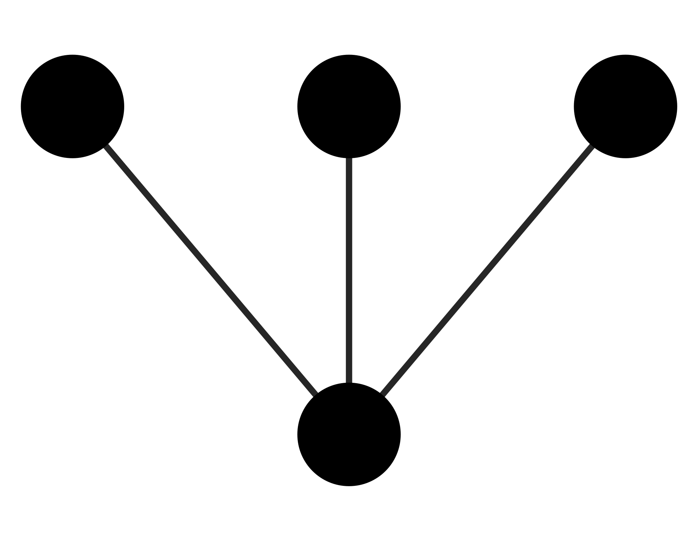
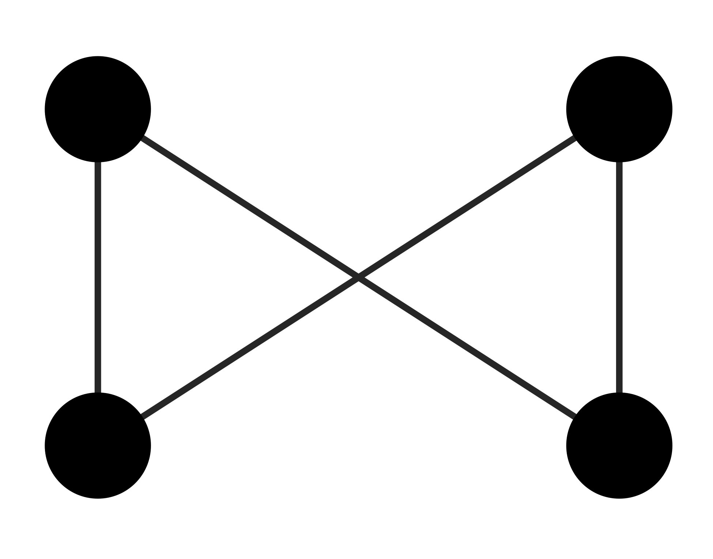
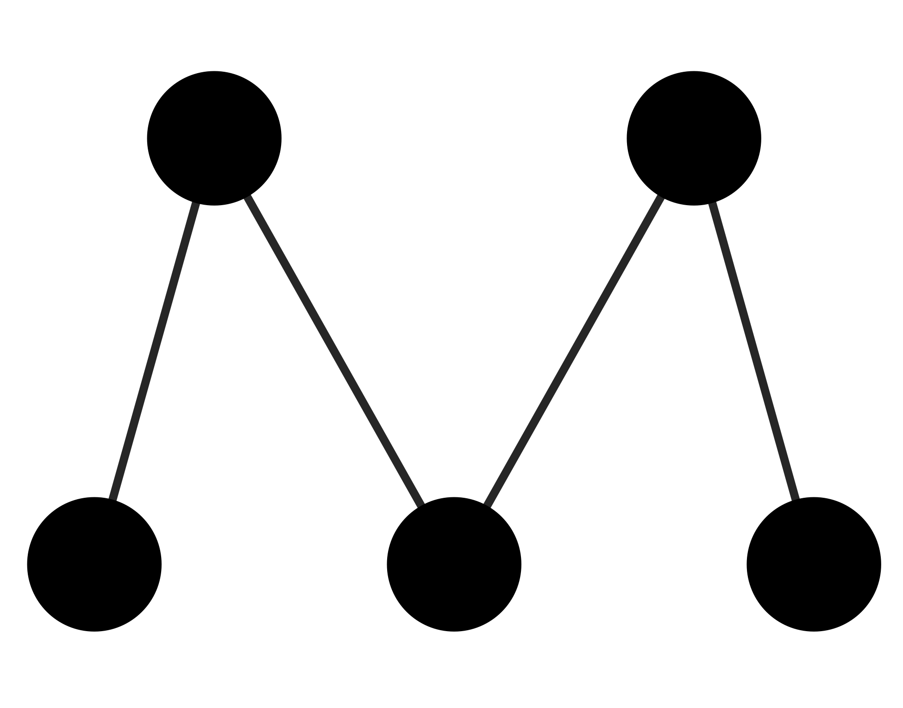

\captionsetup[table]{labelformat=empty}

```{r setup, include=FALSE}
knitr::opts_chunk$set(echo = TRUE)
```

# Abstract

\singlespacing

Ecological processes leave distinct structural imprints on species interactions shaping the topology of mutualistic networks. Detecting those relationships is not trivial since they go beyond pairwise interactions, but may get blurred when considering full network descriptors. However, recent work has shown the network meso-scale can capture this important information. The meso-scale describes network subgraphs representing patterns of interactions between a small number of species (i.e., motifs) and those constitute the building blocks of the whole network. Despite the possible implications of network motifs to better capture species interactions, they remain overlooked in natural plant-pollinator networks. By exploring 60 networks from 18 different studies with wide geographical coverage we show that some motifs are consistently under- and over-represented worldwide, suggesting that the building blocks of plant-pollinator networks are not random. Furthermore, we found that distinct motif positions describing species ecological roles (e.g., generalization and number of indirect interactions) are occupied by different groups on both trophic levels. Bees and plant species with separated sexes on different or the same individuals (e.g., dioecious or monoecious species) appeared consistently in generalist motif positions with lower number of indirect interactions. The rest of floral visitor groups tended to appear with more frequency on motif positions that involved higher specialization and higher number of indirect interactions while the rest of plant groups showed similar frequencies on the different motif positions. Interestingly, the realized combinations of different groups within a motif can not be retrieved from their joint probability distributions, indicating that group combinations are not random either. Our result highlights the non-random structure of the meso-scale on plant-pollinators networks and the association of different plant and floral visitor groups with certain motifs with different ecological roles at a macro-ecological scale.

Keywords: plant-pollinator networks, plant-pollinator interactions, network motifs, functional groups, plant traits, floral visitors

\doublespacing

# Introduction

Ecological communities are formed by a plethora of interacting species that form networks of interactions. Because of the tremendous complexity of these ecological networks, species interactions are generally condensed in metrics that summarize this information [@guimaraes2020]. Plant-pollinator interactions are no exception, and they are often studied with indices that aggregate the information at the species (micro-scale) or network level (macro-scale). For example, plant-pollinator network level approaches have identified common invariant structural properties across networks, including a degree distribution that decays as a power law [@jordano1987], nestedness [@bascompte2003], or modularity [@olesen2007]. In addition, the local species position within the network can define its degree of specialization [@bluthgen2006] or its role connecting the rest of the community [@olesen2007]. Despite the unquestionable progress with the use of these metrics at both species and network level, condensing the information into a single metric implies the loss of relevant ecological information that obscure the understanding of species interactions [@cirtwill2018; @simmons2019].
 
Traditionally, plant-pollinator research has focused on direct interactions but overlooked indirect interactions (i.e., the mediated effect between two species by a third species), such as facilitative or competitive interactions between plants for pollinators [@moeller2004; @sargent2008]. Despite the widespread nature of indirect interactions in ecological communities [@strauss1991], plant-pollinator research often fails to finely capture those indirect interactions with the conventional analytical tools that condense the information either by species (e.g., interaction frequency) or in global topological indices (e.g., nestedness). Nonetheless, the emerging framework of network motifs (small sub-networks recorded within a given network) in plant-pollinator research allows to consider both direct and indirect interactions [@simmons2019]. Motifs are often referred to as the building blocks of a network that depict subsets of interactions [@milo2002]. The analysis of network motifs in plant-pollinator networks have revealed that the different ecological processes that govern species interactions (e.g., species abundances versus trait-matching) can lead to different patterns of indirect interactions [@simmons2020]. Yet, the global patterns of indirect interactions in real plant-pollinator networks are still unknown (e.g., over- and under- represented motifs).

By linking the structural properties of the meso-scale with the species ecology we can progress knowledge on species interactions. For instance, different motifs can have different ecological meanings [@simmons2019] and the position within a motif can determine the species functional role [@stouffer2012; @baker2015]. Yet, our understanding of the ecological implications of network motifs in real plant-pollinator networks remains in its infancy. Moreover, it is unclear how the species ecology and life-history traits determines the species' functional role within the network of interactions [@coux2016]. For example, large pollinators can forage larger distances [@greenleaf2007], deposit greater pollen quantities [@foldesi2021] and handle complex zygomorphic flowers in comparison with small pollinators that are restricted to lower floral complexity [@gong2009]. How this different pollinator behavior translates into their interaction topology is unknown. Similarly, recent empirical findings indicate that the meso-scale is the best descriptor of plant reproductive success [@allen2021], but little is known about how plants reproductive strategies shape their position within the network of interactions. Although some studies have evaluated plant reproductive strategies in plant-pollinator networks [@tur2013; @lazaro2020], this is an often overlooked aspect in a community context [@devaux2014] and rarely incorporated into plant-pollinator network studies. Hence, exploring how the main plant reproductive strategies integrate with the emergent motif framework could help to progress knowledge on plant-pollinator interactions. 

Here, we used 60 plant-pollinator networks from 18 different studies and 14 countries, alongside functional groups of plants and taxonomic groups of floral visitors based on functional traits and taxonomic rank, respectively. To obtain plant functional groups, we used a comprehensive dataset that included floral, reproductive and vegetative traits compiled in a larger set of networks. Floral visitor groups were divided by the main taxonomic groups that differed in life form and behaviour. Once we split the different plant-pollinator networks into their motif elements, we explored: (i) if there is a common invariant structural property in the overall motif networks (i.e. over- and under-represented motifs); (ii) which plant and floral visitor groups are over- and under-represented in the different motif positions; and, (iii) if there are over- and under-represented plant and floral visitor group combinations within a motif.

# Methods

**Plant-pollinator studies**

We have compiled 60 plant-pollinator networks from 18 different studies (**Table S1**). All studies sampled plant-pollinator interactions in natural systems and were selected based on wide geographical coverage and presence of interaction frequency as a measure of interaction strength. In total, there were 503 plant species, 1,111 floral visitors species and 6,248 pairwise interactions registered. For ease of data manipulation, plant and floral visitor species names were standardize with the help of the R package _taxize_ version _0.9.99_ [@chamberlain2020]. All analyses and data manipulation were conducted in R _version 4.0.5_ [@R]. 

**Plant and floral visitor groups**

First, plant species were grouped through hierarchical clustering into the optimal number of functional groups that summarized the main plant reproductive strategies. For this, we used the trait dataset collated in @lanuza2021 that comprised a total of 1506 species including the 503 species considered in this study (**Table S2**). This dataset consisted on 8 floral, 4 reproductive and 3 vegetative traits excluding traits with high percentage of missing values (over 30$\%$; **Table S3**). We opted to calculate the plant functional groups on this larger set of species because of the higher accuracy when delimiting functional groups with that many variables and species [@dolnicar2014]. To feed the clustering analysis, we calculated the distance between the different qualitative and scaled quantitative variables with Gower distance [@gower1971]. For this, we used the function _gowdis_ with method _ward.D2_ from the package _FD_ version _1.0-12_ [@laliberte2014]. Finally, we conducted hierarchical clustering with the function _hclust_ from the _R_ stats package version _4.0.5_ and calculated the optimal number of clusters with the function _kgs_ from the package _maptree_ version _1.4-7_ [@white2009].

Second, floral visitors were grouped into taxonomic groups based on taxonomic rank as done similarly in other plant-pollinator studies [@fenster2004; @ollerton2009]. We opted to divide floral visitors on the taxonomic rank level and not with functional traits because the main orders of floral visitors differed in form and behaviour and had lower superior taxonomical complexity (i.e., floral visitors had 6 orders versus plants that had 38). Thus, this allowed us to group floral visitors into groups that represented approximately the main life strategies of the possible pollinators: (i) bees (Hymenoptera-Anthophila), (ii) non-bee Hymenoptera (Hymenoptera-non-Anthophila), (iii) syrphids (Syrphidae-Diptera), (iv) non-syrphids-Diptera, (v) Lepidoptera and (vi) Coleoptera. However, a minor set of species belonged to other taxonomic groups that were considered in analyses but not discussed further because of their low representation in the full set of networks (3.55$\%$ of the total interactions recorded). These taxonomic groups were 'lizards', 'birds' and 'other insects'. This last group was formed by a mix of uncommon insect taxa on the full set of networks. 

**Overall motif patterns**

Following previous work [@simmons2019b; @simmons2020], we broke down the plant-pollinator networks into their constituent motifs that can capture both direct and indirect interactions. Prior to analyses, we turned the quantitative networks into qualitative (or binary) ones, where interactions are present or absent. All analyses were run considering singletons (species with only one interaction detected) but we conducted a second exploration without singletons (64.98$\%$ of interactions) to evaluate the effect of rare species on the observed patterns. Results without singletons are qualitatively consistent and are not further discussed in the main text (**Figures S1 and S2**). 

We calculated the frequency of all motifs up to five nodes (17 different motifs in total; see **Figure 1**) for each empirical network, by using the _bmotif_ package version _2.0.2_ [@bmotifsimmons2019]. We focused exclusively on motifs up to five nodes in our analyses for computational reasons and for the ease of visualization and interpretation of a reduced set of less complex network motifs. Throughout the entire manuscript, floral visitors occupy the top nodes of the different motifs and plants the bottom ones. To control for variation in network size, motif frequencies were normalised as a proportion of the total number of motifs within each motif class (i.e., the number of nodes a motif contains). In addition, we excluded two-node motifs (or links) from our analyses because their normalised frequencies would always equal one. Like @simmons2020, we classified the different motifs by their average path length (mean number of links between all pairs of nodes) into four different groups: (i) complete or strong ($\overline{x} = 1.38$), (ii) fan or medium-strong ($\overline{x} = 1.48$), (iii) assymmetric complete or medium-weak ($\overline{x} = 1.60$) and (iv) core-peripheral or weak ($\overline{x} = 1.85$). In general terms, plant and floral visitor groups on more densely connected motifs (e.g., complete or fan) will experience lower number of indirect interactions in contrast to groups on less densely connected ones (e.g., medium-weak or weak).


```{r, echo=FALSE, message=FALSE, cache=FALSE, fig.pos="t", warning=FALSE,out.width="75%",fig.align="center", fig.cap="\\textbf{Figure 1.} Adapted figure of Simmons et al., 2019 with all the possible motifs from two to five species in bipartite networks. There is a total of 17 possible motifs with 46 different positions denoted within each node.", fig.width=10,fig.height=8}
library(tidyverse)
library(RColorBrewer)
source("../../Scripts/Scripts_Alfonso/plot_motif_positionsV2.R")

motif_number <- 1
p1 <- plot_motif_positions(motif_number)

motif_number <- 2
p2 <- plot_motif_positions(motif_number)

motif_number <- 3
p3 <- plot_motif_positions(motif_number)

motif_number <- 4
p4 <- plot_motif_positions(motif_number)

motif_number <- 5
p5 <- plot_motif_positions(motif_number)

motif_number <- 6
p6 <- plot_motif_positions(motif_number)

motif_number <- 7
p7 <- plot_motif_positions(motif_number)

motif_number <- 8   
p8 <- plot_motif_positions(motif_number)

motif_number <- 9
p9 <- plot_motif_positions(motif_number)

motif_number <- 10
p10 <- plot_motif_positions(motif_number)

motif_number <- 11
p11 <- plot_motif_positions(motif_number)

motif_number <- 12
p12 <- plot_motif_positions(motif_number)

motif_number <- 13
p13 <- plot_motif_positions(motif_number)

motif_number <- 14
p14 <- plot_motif_positions(motif_number)

motif_number <- 15
p15 <- plot_motif_positions(motif_number)

motif_number <- 16
p16 <- plot_motif_positions(motif_number)

motif_number <- 17
p17 <- plot_motif_positions(motif_number)


library(patchwork)

(p1 & ylab("2 species")| p2 & ylab("3 species") | p3 )/ (p4 & ylab("4 species")| p5 | p6 | p7)/ (p8  & ylab("5 species")| p9 | p10 | p11 | p12) / (p13 & ylab("5 species")| p14 | p15 | p16 | p17) & theme(axis.title.y = element_text(color="black", size=14, face="bold")) #+
 #plot_annotation(tag_levels = '1') 

```


To assess the significance of the observed frequencies, we created 1,000 simulated networks for each binary network using the _nullmodel_ function and the _vaznull_ model in the _bipartite_ package version _2.14_ [@dormann2009]. Generated networks had the same number of plants and floral visitors, as well as the same connectance of their corresponding empirical networks. More restricted null models with also degree as constant were also explored but did not allowed sufficient permutations given that many constraints and provided highly similar or identical networks to the original ones. We discarded null models with more constraints (e.g., degree also constant) because they did not allow sufficient permutations and provided highly similar or identical networks to the original ones.

After extracting the motif frequencies from the simulated networks, for each motif type and empirical network, we calculated the percentage of simulated networks whose frequencies were smaller than the ones observed, that is, we estimated the percentile of the observed motif frequencies. Motifs whose percentile is close to 0 or 100 are under- or over-represented in the empirical networks, respectively, and thus they cannot be predicted by connectance and the number of species alone. To summarize general patterns across networks, we used an intercept-only linear mixed model (LMM) per motif with the help of the package lmer version _1.1-21_ [@bates2015], where the response variable was the observed motif percentile per network. In these models, we used the study identifiers in **Table S1** as a random intercept. By doing so, we obtained estimates of the average motif frequency, but controlling the variation at the study level. 

**Over- and under-represented groups on motif positions**

We calculated which plant and floral visitor groups were over- or under-represented in the different motif positions by comparing position frequencies of empirical networks with those of their corresponding simulated counterparts. To estimate the position frequencies of each plant and floral visitor group in a given network, we added the frequencies of those species that belong to the group, and then, we normalised the resulting frequencies by dividing the position measure for each group by the total number of times that a group appears in any position within the same motif size class. Then, we calculated the percentile of the observed position frequencies for each group and network, just like we did with motif frequencies. To outline the general patterns of position frequencies across networks and groups, we fit a LMM per motif position, where the response variable was the observed position percentile per network. We used the group identifier as an explanatory variable and the study identifiers as a random intercept. By adding the group estimates to the model intercept, we assessed the average motif frequency, after controlling the variation at the study level. Finally, we visualized with the help of the package _ComplexHeatmap_ version _2.6.2_ [@gu2016] over- and under-representation of plant and floral visitor groups on the different motif positions. 

To understand if the different plant and floral visitor groups are associated with motif positions that involve different network roles (e.g., specialization or generalism and number of indirect interactions). First, we calculated the specificity of the different motif positions and evaluated its association through linear models with the average frequency of the different plant and floral visitor groups as response variable. For this, we previously calculated the specificity ($s_i$) of each motif position following @poisot2015 as $s_i = L - l_i / L - 1$, where $L$ is the total number of groups and $l_i$ the number of interaction partners of the group $i$ in a given motif. Values of the vector s, range between 1, complete specialization (1 partner within the motif) and 0, complete generalism (all possible partners within the motif). Second, for each motif position we determined the proportion of indirect-direct interactions, considering indirect interactions exclusively as the mediated effect between two species by a third species. Therefore, we account exclusively for the indirect interactions of floral visitors through plants (e.g., floral visitor - plant - floral visitor) and the indirect interactions of plants through floral visitors (e.g., plant - floral visitor - plant).

**Over- and under-represented group combinations of motifs**

We studied which combinations of plant and floral visitor groups tend to appear together within the same motifs (up to five nodes). That is which combinations are over- or under-represented. This analysis use 57 out of the 60 networks available due to computational limitations to identify all the nodes in the motifs of the three networks with the highest number of links. To do so, for each of the 53,250 possible motif combinations, we estimated the observed and the expected probability of finding those combination in empirical networks, respectively. Then, we determined whether the observed probabilities are likely to come from the expected probabilities or not. To calculate the observed probability ($p_i^O$) of the different groups within a motif $i$ (e.g., motif 3, 'bee' + 'bee' + 'selfing herbs'), we divided the number of times that $i$ appears in our set of empirical networks ($n_i^O$) by the sum of the number of times that each possible combination appeared: $p_i^O = n_i^O / \sum_{k=1}^{53,250} n_k^O$. To estimate the expected probability of a given motif combination $i$, $p_i^E$, firstly, we calculated the probability of finding a given group $x$ in the position $\alpha$ of $i$, $p_i(x,\alpha)$. Then, by assuming the independency of $p_i(x,\alpha)$, we computed the expected probability of the combination $i$ as the product of the probability of its pairs $(x,\alpha)$, that is, $p_i^E = \prod _{(x,\alpha )\in i} p_i(x,\alpha)$. To obtain $p_i(x,\alpha)$, we proceeded as follows. First, we calculated the number of times that the group $x$ appears in the position $\alpha$ in each empirical network $\eta$, denoted as $n_i^{\eta}(x,\alpha)$. Then, by controlling the variation at the network level, we assessed the average value of the absolute frequency of group $x$ appears in the position $\alpha$, $n_i(x,\alpha) = E\left [ n_i^{\eta}(x,\alpha) \right ]$, and estimated $p_i(x,\alpha)$ as $p_i(x,\alpha) = n_i(x,\alpha)/\sum_{k}n_i(k,\alpha)$. To obtain $n_i(x,\alpha)$, we fitted a LMM per motif position, where the response variable was the number of times that a given position was observed per network, the explanatory variable was the group identifier, and the random intercept was given by network identifiers nested within the study identifiers. 

Once we obtained $p_i^O$ and $p_i^E$, we used a simulation approach to determine whether the former is likely to come from the latter or not. This approach was preferred since the large number of possible motif combinations and the small probabilities for some of them advise against using an exact test of goodness-of-fit or a Chi-square one. Specifically, we created 1,000 random samples with repetition of possible motif combinations, where each sample contained 10 million elements and, for each combination, the probability of being selected was equal to its expected probability. From those random samples, we extracted the mean and the standard deviation of the expected probability of $i$, denoted as $E\left [ p_i^E \right ]$ and $\sigma\left [ p_i^E \right ]$, respectively, and calculated the z-scores of $p_i^O$ as $z_i^O = \left ( p_i^O - E\left [ p_i^E \right ] \right )/\sigma \left [ p_i^E \right ]$, for those motif combinations with $p_i^O > 0$. According to the usual interpretation of z-scores, combinations with $z_i^O > 1.96$ are over-represented, whereas those with $z_i^O < -1.96$ are under-represented, at the 95$\%$  confidence level. Notice that we focused on combinations with $p_i^O > 10^{-7}$ because we do not have enough numerical resolution to accurately detect whether combinations that took place only once are under-represented (due to the limited size of our random samples).


# RESULTS

**Plant and floral visitor groups**

The hierarchical cluster analysis divided the dataset into five different groups with different and overlapping characteristics (**Figure S3** and **Figure S4**). The first group referred to as 'selfing herbs' consisted on herbs with hermaphroditic flowers with high levels of autonomous selfing. The second group named 'small outcrossing perennials' had small perennial species with a mixed of life forms (i.e., trees shrubs and herbs) with outcrossing hermaphroditic flowers. The third group referred to as 'self-incompatible perennials with large flowers' comprised perennial species with a mixed of life forms and large self-incompatible hermaphroditic flowers with high number of ovules. The fourth group named 'tall plants with small unisexual flowers' had the tallest species, highest proportion of shrub and tree life forms, dioecious and monoecious breeding systems, small flowers and the highest numbers of flowers and inflorescences per plant. Finally, the fifth group named 'short-lived outcrossers with long zygomorphic flowers' consisted on small perennial and short-lived herbs with long self-compatible zygomorphic flowers that were unable to self-pollinate.

In total, there were 1,126 species of floral visitors with 6,325 interactions recorded with plants. Most plants interacted with bees (2,256 interactions) and non-syrphid Diptera (1,768) followed by syrphids (845), Lepidoptera (437), Coleoptera (432) and non-bee Hymenoptera (362).

**Overall motif patterns**

Most motifs were under- and over-represented (close to the 1st and 99th percentile, respectively) in the comparison between empirical and simulated networks (**Figure 2**). Motifs 3, 5, 9, 10 and 14 were under-represented in empirical networks, that is, all were close to the 1st percentile and under the 25th percentile. Interestingly, four out of five of these motifs belonged to the largest path length classification (i.e., core-peripheral). In addition, motifs 2, 6, 7, 16 and 17 were over-represented, all over the 75th percentile and thus the closest to the 99th percentile. In contrast to the under-represented motifs, over-represented motifs belonged to the two shortest path length groups (i.e., complete and fan). The remaining motifs (i.e., 4, 8, 11, 12, 13, and 15) were between the 25th and 75th percentile. Notably, the exclusion of singletones from this analysis did not change the observed results (**Figure S1**). 

For both floral visitor and plant groups we found different frequencies on motif positions that implied different ecological roles. First, for floral visitors we found that bees had a tendency to appear with higher frequency on motif position that involved generalism while the rest of taxonomic groups (non-syrphid Diptera, syrphids, Lepidoptera, Coleoptera and non-bee Hymenoptera) showed the opposite trend with higher frequency on motif positions that implied greater level of specialization (**Figure S2 A**). All plant functional groups showed a slight tendency for generalism (**Figure S2 B**). Second, regarding the number of indirect interactions, bees and tall plants with unisexual flowers showed greater frequency on motif positions that had low number of indirect interactions but high of direct interactions (**Figure S3 and Figure S4**). The rest of floral visitor groups showed the opposite tendency and had higher frequencies on motif positions with high number of indirect interactions but low of direct interactions (**Figure S3**). The rest of plant groups did not show major differences on their frequencies on motifs that implied different proportion of indirect-direct interactions (**Figure S4**).


```{r, echo=FALSE, message=FALSE, cache=FALSE,  warning=FALSE, fig.width=4.5,fig.height=6.5, fig.cap="**Figure 2.** Comparison of motif frequencies between empirical and simulated networks grouped by average path length (plots a, b, c and d) as determined in Simmons et al. (2020). This is shown with the mean percentage of motif frequencies in empirical networks that were over the motif frequencies of the simulated ones (percentiles). This was done by network (light blue dots) and then averaged for all networks (black dots with error bars that correspond to the standard deviation)."}
library(lme4)
library(nlme)
library(tidyverse)
source("../../Scripts/Scripts_Alfonso/add_study_id.R")
d <- read_csv("../../Data/Csv/Motifs_frequencies_and_null_models/Motifs_frequency_percentile.csv")
d <- add_study_id(d)
#str(d)
#head(d)

#ggplot(d %>% filter(motif != 1), aes(percentil_sizeclass))+
#  geom_histogram(color="black", fill="white")+
#  facet_wrap(~motif)+
#  theme_bw()+
#  labs(x="Sizeclass percentile")
#
# Motifs tend to be over- and under-represensented in real networks

# Mean percentile and SE taking into account the study system
motif_codes <- d %>% filter(motif != 1) %>% # We remove links (motif code: 1)
  select(motif) %>% unique() %>% pull()
motif_means <- tibble(motif = motif_codes)
motif_means$mean <- NA
motif_means$SE <- NA

for(i.motif in 1:length(motif_codes)){
  
  m <- lmer(percentil_sizeclass ~ 1+(1|study_id), #HERE WE NEED STUDY SYSTEM ONLY!! 
            data = subset(d, motif == motif_codes[i.motif]))  
  
  motif_means$mean[i.motif] <- fixed.effects(m) %>% unname()
  motif_means$SE[i.motif] <- sqrt(diag(vcov(m)))
  
}

#Add categories based on path length set by Simmons 2021 et al., Functional Ecology
d$Broad_categories[d$motif==2 | d$motif==7 | d$motif==17 | d$motif==3|d$motif==4|d$motif==8] <- "Fan" 

d$Broad_categories[d$motif==15 | d$motif==11] <- "Medium-weak" 

d$Broad_categories[d$motif==6 | d$motif==16 |  d$motif==12] <- "Strong" 

d$Broad_categories[d$motif==5 | d$motif==9 |  d$motif==14|  d$motif==13|  d$motif==10] <- "Weak" 

#order the categories from short to long path length
d$Broad_categories <- factor(d$Broad_categories, levels = c("Strong", "Fan", "Medium-weak", "Weak"))

#Ffilter out two node motifs
d_1 <- d %>% filter(motif != 1)
#Merge dataframes to bl able to create facets
d_2 <- merge(d_1, motif_means, by="motif")

arr <- list('Strong' = expression(bold(paste("(a) Strong (Complete, ", bar(x), " = 1.38)"))),
             'Fan' = expression(bold(paste("(b) Medium-strong (fan, ", bar(x), " = 1.48)"))), 
             'Medium-weak' = expression(bold(paste("(c) Medium-weak (asymmetric complete, ", bar(x), " = 1.60)"))), 
             "Weak" =expression(bold(paste("(d) Weak (core-peripheral, ", bar(x), " = 1.85)"))))
mylabel <- function(val) { return(lapply(val, function(x) arr[x])) }

library(ggforce) #workaround with ggforce to have facets with same sizes 
library(ggtext)

labels <- c("2" = "*Motif 2* " ,
          "3"= "*Motif 3* ",
          "4"= "*Motif 4* ",
          "5"= "*Motif 5* ",
          "6"= "*Motif 6* ",
          "7"= "*Motif 7* ",
          "8"= "*Motif 8* ",
          "9"= "*Motif 9* ",
          "10"= "*Motif 10* ",
          "11"= "*Motif 11* ",
          "12"= "*Motif 12* ",
          "13"= "*Motif 13* ",
          "14"= "*Motif 14* ",
          "15"= "*Motif 15* ",
          "16"= "*Motif 16* ",
          "17"= "*Motif 17* ")
            

p <- ggplot()+geom_point(data = d_2 , aes(y=factor(motif), 100*percentil_sizeclass), shape=21,color="black",fill="azure2",size=1.75, alpha=0.3)+
  geom_errorbar(data = d_2,aes(y = factor(motif), xmin=100*(mean-SE), xmax=100*(mean+SE)), 
                width=0.8,size=0.8,color="black") +theme_bw()+
  geom_point(data = d_2,aes(y = as.factor(motif), x=100*mean), 
             size=2,color="black")+labs(y="Two to five node motifs", x = "Percentile")+
  theme( strip.background = element_blank())+
  theme(strip.text = element_text(face="bold", size=10, hjust=0),
        panel.border=element_rect(color="black",size=1.2))+
  scale_y_discrete(name = NULL,
                   labels = labels) +
  theme(axis.text.y = ggtext::element_markdown())

p + ggforce::facet_col(vars(Broad_categories), scales = 'free', space = 'free',labeller=mylabel)


#Trying to maintain a gradient from low to high in colors

#Fig 1 Should be a dot plot (or forest plot) of the mean +- SE of the 15 motifs.
#NICE! Can we put motifs in Y axes, and % in X?
```

**Over- and under-represented groups on motif positions**


```{r , include=FALSE}

#SAME SCRIPT AS THE PLOTTING FOR THE HEATMAP BUT I NEED IT HERE TO LOAD THE VARIABLES WITH VALUES ON RESULTS

library(lme4)
library(nlme)
library(tidyverse)
library(stringi)
source("../../Scripts/Scripts_Alfonso/add_study_id.R")

#############################################
# EXTRACT MEAN VALUES
#############################################
all_position_percentiles <- read_csv("../../Data/Csv/Motifs_positions_and_null_models/GF_positions_frequency_percentile.csv")

all_position_percentiles$position <- stri_extract_first_regex(all_position_percentiles$position,
                                                              "[0-9]+") %>% as.numeric()

all_position_percentiles <- add_study_id(all_position_percentiles)
#str(all_position_percentiles)
#head(all_position_percentiles)

list_plants_FG <- as.character(1:10)

plant_position_percentiles_filtered <- all_position_percentiles %>% 
  filter(Node_FG %in% list_plants_FG, !position %in% c(1,2),
         !is.na(expected_freq_its_GF)) #ME DA ERROR
pollinator_position_percentiles_filtered <- all_position_percentiles %>% 
  filter(!Node_FG %in% list_plants_FG, !position %in% c(1,2),
         !is.na(expected_freq_its_GF))


# Plants-------------

# Mean percentile and SE taking into account the study system
plant_codes <- plant_position_percentiles_filtered$position %>% unique()
plant_means <- plant_position_percentiles_filtered %>% select(position,Node_FG) %>% unique()
plant_means$mean <- NA
plant_means$SE <- NA


for(i.pos in 1:length(plant_codes)){
  
  m <- lmer(percentil_its_GF ~ Node_FG + (1|study_id),
            data = plant_position_percentiles_filtered %>%
              filter(position == plant_codes[i.pos]))  
  
  temp <- fixed.effects(m) %>% unname()
  plant_means$mean[plant_means$position == plant_codes[i.pos]] <- c(temp[1],
                                                                    temp[1]+temp[2],
                                                                    temp[1]+temp[3],
                                                                    temp[1]+temp[4],
                                                                    temp[1]+temp[5]) ## to get real means per FG
  temp <- sqrt(diag(vcov(m)))
  plant_means$SE[plant_means$position == plant_codes[i.pos]] <- c(temp[1], 
                                                                  temp[1]+temp[2],
                                                                  temp[1]+temp[3],
                                                                  temp[1]+temp[4],
                                                                  temp[1]+temp[5])
  
}


# Pollinators--------

# Mean percentile and SE taking into account the study system
pollinator_codes <- pollinator_position_percentiles_filtered$position %>% unique()
pollinator_means <- pollinator_position_percentiles_filtered %>% select(position,Node_FG) %>% unique()
pollinator_means$mean <- NA
pollinator_means$SE <- NA
pollinator_means_reordered <- NULL

for(i.pos in 1:length(pollinator_codes)){
  
  m <- lmer(percentil_its_GF ~ Node_FG + (1|study_id), #HERE WE NEED STUDY SYSTEM ONLY!! 
            data = pollinator_position_percentiles_filtered %>%
              filter(position == pollinator_codes[i.pos]),
            control = lmerControl(optimizer ="Nelder_Mead")) # I changed the optimizer because motif 8 (i.pos = 3) caused convergence problems, max gradient = 0.0022 > 0.002.
  
  temp <- fixed.effects(m) %>% unname()
  pollinator_means_aux <- pollinator_means[pollinator_means$position == pollinator_codes[i.pos],] %>% arrange(Node_FG)
  
  pollinator_means_aux$mean <- c(temp[1],
                                 temp[1]+temp[2],
                                 temp[1]+temp[3],
                                 temp[1]+temp[4],
                                 temp[1]+temp[5],
                                 temp[1]+temp[6],
                                 temp[1]+temp[7],
                                 temp[1]+temp[8],
                                 temp[1]+temp[9]) ## to get real means per FG
  
  
  temp <- sqrt(diag(vcov(m)))
  pollinator_means_aux$SE <- c(temp[1],
                               temp[1]+temp[2],
                               temp[1]+temp[3],
                               temp[1]+temp[4],
                               temp[1]+temp[5],
                               temp[1]+temp[6],
                               temp[1]+temp[7],
                               temp[1]+temp[8],
                               temp[1]+temp[9])
  
  pollinator_means_reordered <- bind_rows(pollinator_means_reordered,pollinator_means_aux)
  
}

# There are lower limits (mean - SE) smaller than 0 (see Other insects)
# We set the lower limit of those error bars to zero

pollinator_means_reordered <- pollinator_means_reordered %>% mutate(lower = mean-SE)
pollinator_means_reordered$lower[pollinator_means_reordered$lower < 0] <- 0

#############################################
# ADDING BROAD MOTIF CATEGORIES TO POSITIONS
#############################################

motifs_raw_data <- read_csv("../../Data/Data_processing/Motifs_connections/motif_pattern_connections.csv")

motifs_raw_data$Broad_categories <- NA

motifs_raw_data$Broad_categories[motifs_raw_data$motif_id %in% c(5,9,14,13,10)] <- "Core-peripherical"
motifs_raw_data$Broad_categories[motifs_raw_data$motif_id %in% c(6,16,12)] <- "Complete"
motifs_raw_data$Broad_categories[motifs_raw_data$motif_id %in% c(2,3,7,4,17,8)] <- "Fan"
motifs_raw_data$Broad_categories[motifs_raw_data$motif_id %in% c(15,11)] <- "Asymmetric complete"

motifs_raw_data$plant <- gsub("[^0-9.-]", "", motifs_raw_data$plant)
motifs_raw_data$pollinator <- gsub("[^0-9.-]", "", motifs_raw_data$pollinator)
motifs_raw_data$plant <- as.numeric(motifs_raw_data$plant)
motifs_raw_data$pollinator <- as.numeric(motifs_raw_data$pollinator)
motifs_raw_data <- motifs_raw_data %>% filter(!is.na(Broad_categories))

fan_pollinator <- motifs_raw_data$pollinator[motifs_raw_data$Broad_categories == "Fan"] %>% unique()
core_per_pollinator <- motifs_raw_data$pollinator[motifs_raw_data$Broad_categories == "Core-peripherical"] %>% unique()
complete_pollinator <- motifs_raw_data$pollinator[motifs_raw_data$Broad_categories == "Complete"] %>% unique()
asymm_pollinator <- motifs_raw_data$pollinator[motifs_raw_data$Broad_categories == "Asymmetric complete"] %>% unique()

pollinator_means_reordered$Broad_categories <- NA

pollinator_means_reordered$Broad_categories[pollinator_means_reordered$position %in% fan_pollinator] <- "Fan" 
pollinator_means_reordered$Broad_categories[pollinator_means_reordered$position %in% asymm_pollinator] <- "Medium-weak" 
pollinator_means_reordered$Broad_categories[pollinator_means_reordered$position %in% complete_pollinator] <- "Strong" 
pollinator_means_reordered$Broad_categories[pollinator_means_reordered$position %in% core_per_pollinator] <- "Weak" 


fan_plant <- motifs_raw_data$plant[motifs_raw_data$Broad_categories == "Fan"] %>% unique()
core_per_plant <- motifs_raw_data$plant[motifs_raw_data$Broad_categories == "Core-peripherical"] %>% unique()
complete_plant <- motifs_raw_data$plant[motifs_raw_data$Broad_categories == "Complete"] %>% unique()
asymm_plant <- motifs_raw_data$plant[motifs_raw_data$Broad_categories == "Asymmetric complete"] %>% unique()

plant_means$Broad_categories <- NA

plant_means$Broad_categories[plant_means$position %in% fan_plant] <- "Fan" 
plant_means$Broad_categories[plant_means$position %in% asymm_plant] <- "Medium-weak" 
plant_means$Broad_categories[plant_means$position %in% complete_plant] <- "Strong" 
plant_means$Broad_categories[plant_means$position %in% core_per_plant] <- "Weak" 


################################################################################
# Alternative code to HEATMAPS to create variables with values to load on text
# in a reproducible/automated way
################################################################################

# PLANTS-----

# Prepare data for heatmap
heat_plants_aux <- plant_means %>% spread(Node_FG,mean) %>% select(-SE) 

heat_plants <- heat_plants_aux %>%
  group_by(position,Broad_categories) %>% 
  summarise_all(sum,na.rm = T)


# POLLINATORS-----------     

filter_rare_groups <- T

if(filter_rare_groups == T){
  heat_pollinators_aux <- pollinator_means_reordered %>% filter(!Node_FG %in% c("Birds",
                                                                                "Lizards",
                                                                                "Other_insects")) %>% 
    spread(Node_FG,mean) %>% select(-SE,-lower)
  
  colnames(heat_pollinators_aux) <- c("position","Broad_categories","Bees",            
                                      "Coleoptera","Lepidoptera","Non-bee\nHymenoptera", 
                                      "Non-syrphids\nDiptera","Syrphids")
}else{
  heat_pollinators_aux <- pollinator_means_reordered %>% spread(Node_FG,mean) %>% select(-SE,-lower)
  
  colnames(heat_pollinators_aux) <- c("position","Broad_categories","Bees","Birds",            
                                      "Coleoptera","Lepidoptera","Lizards","Non-bee\nHymenoptera", 
                                      "Non-syrphids\nDiptera","Other insects","Syrphids")
}


heat_pollinators <- heat_pollinators_aux %>%
  group_by(position,Broad_categories) %>% 
  summarise_all(sum,na.rm = T)

specify_decimal <- function(x, k) trimws(format(round(x, k), nsmall=k))

#Check percentage of over and under represented
colMeans(heat_pollinators[,c(3:8)] < 0.25)
poll_under_25 <- colMeans(heat_pollinators[,c(3:8)] < 0.25)
poll_under_25 <- specify_decimal((poll_under_25[[1]] + poll_under_25[[2]] + poll_under_25[[3]] +
poll_under_25[[4]] + poll_under_25[[5]] + poll_under_25[[6]])/6*100,2)
#[1] 32.57576

colMeans(heat_pollinators[,c(3:8)] > 0.75)
poll_over_75 <- colMeans(heat_pollinators[,c(3:8)] > 0.75)
poll_over_75 <- specify_decimal((poll_over_75[[1]] + poll_over_75[[2]] + poll_over_75[[3]] +
    poll_over_75[[4]] + poll_over_75[[5]] + poll_over_75[[6]])/6*100,2)
#[1] 4.545455

#################################################################################
#################################################################################

colnames(heat_plants)<- c("position", "Broad_categories", "one",
                               "two", "three","four",
                               "five")
f <- heat_plants %>%
  mutate(min = pmin(1,
                    one, two,three,
                    four, five))%>%
  mutate(max = pmax(one,
                    two, three,four,
                    five))

diff_1 <- f$max-f$min

cbind(diff,diff_1)

#Check percentage of over and under represented per FG
colMeans(heat_plants[,c(3:7)] < 0.25)
plant_under_25 <- colMeans(heat_plants[,c(3:7)] < 0.25)
plant_under_25 <- specify_decimal((plant_under_25[[1]] + plant_under_25[[2]] + plant_under_25[[3]] + 
    plant_under_25[[4]] + plant_under_25[[5]])/5*100,2)
#[1] 18.18182
colMeans(heat_plants[,c(3:7)] > 0.75)
plant_over_75 <- colMeans(heat_plants[,c(3:7)] > 0.75)
plant_over_75 <- specify_decimal((plant_over_75[[1]] + plant_over_75[[2]] + plant_over_75[[3]] + 
    plant_over_75[[4]] + plant_over_75[[5]])/5*100,2)
#[1] 8.181818

#overall percentages
under <- specify_decimal((as.numeric(poll_under_25) + as.numeric(plant_under_25))/2,2)
over <- specify_decimal((as.numeric(poll_over_75) + as.numeric(plant_over_75))/2,2)

```

The comparison of the plant and floral visitor group frequencies per motif position between empirical and simulated networks showed a `r over`$\%$ and `r under`$\%$ of over- (>75$^{th}$) and under-represented (<25th) groups in the different positions, respectively (**Figure 3**). Floral visitors showed a total of `r poll_over_75`$\%$ and `r poll_under_25`$\%$ of over- and under-represented groups in the different positions and plants `r plant_over_75`$\%$ and `r plant_under_25`$\%$ of over- and under-represented groups, respectively. Notably, the differences across groups were more marked for floral visitors than for plant groups (the differences between min and max percentiles per position were generally two-three times larger for floral visitors). From most over- to under-represented floral visitors groups on the different motif positions (indicated with the dendrogram order in **Figure 3**), we found: bees, non-syrphids Diptera, syrphids, Coleoptera, non-bee Hymenoptera and Lepidoptera. Although plant functional groups showed less differences between them, there were also more represented groups than others, thus from most over- to under-represented groups on the different motif positions we found: self incompatible perennials with large flowers, small outcrossing perennials, tall plants with unisexual flowers, selfing herbs and short lived outcrossers with long zygomorphic flowers.

```{r, echo=FALSE, message=FALSE, cache=FALSE,  warning=FALSE, fig.height=8,fig.width=8,fig.align = 'center', out.width="80%",fig.cap="\\textbf{Figure 3.} Heatmap indicating under- and over-representation of floral visitor and plant groups in the different motif positions. The different motif positions are dividied by the average path length clasification determined by Simmons et al. (2020) and they are ordered from the most densely connected motifs (strong or complete) to the less connected ones (weak or core-peripheral). The superior dendrogram indicates the differences across groups with the more separated groups showing larger differences."}

library(lme4)
library(nlme)
library(tidyverse)
library(stringi)
source("../../Scripts/Scripts_Alfonso/add_study_id.R")

#############################################
# EXTRACT MEAN VALUES
#############################################


all_position_percentiles <- read_csv("../../Data/Csv/Motifs_positions_and_null_models/GF_positions_frequency_percentile.csv")

all_position_percentiles$position <- stri_extract_first_regex(all_position_percentiles$position,
                                                              "[0-9]+") %>% as.numeric()

all_position_percentiles <- add_study_id(all_position_percentiles)
#str(all_position_percentiles)
#head(all_position_percentiles)

list_plants_FG <- as.character(1:10)

plant_position_percentiles_filtered <- all_position_percentiles %>% 
  filter(Node_FG %in% list_plants_FG, !position %in% c(1,2),
         !is.na(expected_freq_its_GF)) #ME DA ERROR
pollinator_position_percentiles_filtered <- all_position_percentiles %>% 
  filter(!Node_FG %in% list_plants_FG, !position %in% c(1,2),
         !is.na(expected_freq_its_GF))


# Plants-------------

# Mean percentile and SE taking into account the study system
plant_codes <- plant_position_percentiles_filtered$position %>% unique()
plant_means <- plant_position_percentiles_filtered %>% select(position,Node_FG) %>% unique()
plant_means$mean <- NA
plant_means$SE <- NA


for(i.pos in 1:length(plant_codes)){
  
  m <- lmer(percentil_its_GF ~ Node_FG + (1|study_id),
            data = plant_position_percentiles_filtered %>%
              filter(position == plant_codes[i.pos]))  
  
  temp <- fixed.effects(m) %>% unname()
  plant_means$mean[plant_means$position == plant_codes[i.pos]] <- c(temp[1],
                                                                    temp[1]+temp[2],
                                                                    temp[1]+temp[3],
                                                                    temp[1]+temp[4],
                                                                    temp[1]+temp[5]) ## to get real means per FG
  temp <- sqrt(diag(vcov(m)))
  plant_means$SE[plant_means$position == plant_codes[i.pos]] <- c(temp[1], 
                                                                  temp[1]+temp[2],
                                                                  temp[1]+temp[3],
                                                                  temp[1]+temp[4],
                                                                  temp[1]+temp[5])
  
}


# Pollinators--------

# Mean percentile and SE taking into account the study system
pollinator_codes <- pollinator_position_percentiles_filtered$position %>% unique()
pollinator_means <- pollinator_position_percentiles_filtered %>% select(position,Node_FG) %>% unique()
pollinator_means$mean <- NA
pollinator_means$SE <- NA
pollinator_means_reordered <- NULL

for(i.pos in 1:length(pollinator_codes)){
  
  m <- lmer(percentil_its_GF ~ Node_FG + (1|study_id), #HERE WE NEED STUDY SYSTEM ONLY!! 
            data = pollinator_position_percentiles_filtered %>%
              filter(position == pollinator_codes[i.pos]),
            control = lmerControl(optimizer ="Nelder_Mead")) # I changed the optimizer because motif 8 (i.pos = 3) caused convergence problems, max gradient = 0.0022 > 0.002.
  
  temp <- fixed.effects(m) %>% unname()
  pollinator_means_aux <- pollinator_means[pollinator_means$position == pollinator_codes[i.pos],] %>% arrange(Node_FG)
  
  pollinator_means_aux$mean <- c(temp[1],
                                 temp[1]+temp[2],
                                 temp[1]+temp[3],
                                 temp[1]+temp[4],
                                 temp[1]+temp[5],
                                 temp[1]+temp[6],
                                 temp[1]+temp[7],
                                 temp[1]+temp[8],
                                 temp[1]+temp[9]) ## to get real means per FG
  
  
  temp <- sqrt(diag(vcov(m)))
  pollinator_means_aux$SE <- c(temp[1],
                               temp[1]+temp[2],
                               temp[1]+temp[3],
                               temp[1]+temp[4],
                               temp[1]+temp[5],
                               temp[1]+temp[6],
                               temp[1]+temp[7],
                               temp[1]+temp[8],
                               temp[1]+temp[9])
  
  pollinator_means_reordered <- bind_rows(pollinator_means_reordered,pollinator_means_aux)
  
}

# There are lower limits (mean - SE) smaller than 0 (see Other insects)
# We set the lower limit of those error bars to zero

pollinator_means_reordered <- pollinator_means_reordered %>% mutate(lower = mean-SE)
pollinator_means_reordered$lower[pollinator_means_reordered$lower < 0] <- 0

#############################################
# ADDING BROAD MOTIF CATEGORIES TO POSITIONS
#############################################

motifs_raw_data <- read_csv("../../Data/Data_processing/Motifs_connections/motif_pattern_connections.csv")

motifs_raw_data$Broad_categories <- NA

motifs_raw_data$Broad_categories[motifs_raw_data$motif_id %in% c(5,9,14,13,10)] <- "Core-peripherical"
motifs_raw_data$Broad_categories[motifs_raw_data$motif_id %in% c(6,16,12)] <- "Complete"
motifs_raw_data$Broad_categories[motifs_raw_data$motif_id %in% c(2,3,7,4,17,8)] <- "Fan"
motifs_raw_data$Broad_categories[motifs_raw_data$motif_id %in% c(15,11)] <- "Asymmetric complete"

motifs_raw_data$plant <- gsub("[^0-9.-]", "", motifs_raw_data$plant)
motifs_raw_data$pollinator <- gsub("[^0-9.-]", "", motifs_raw_data$pollinator)
motifs_raw_data$plant <- as.numeric(motifs_raw_data$plant)
motifs_raw_data$pollinator <- as.numeric(motifs_raw_data$pollinator)
motifs_raw_data <- motifs_raw_data %>% filter(!is.na(Broad_categories))

fan_pollinator <- motifs_raw_data$pollinator[motifs_raw_data$Broad_categories == "Fan"] %>% unique()
core_per_pollinator <- motifs_raw_data$pollinator[motifs_raw_data$Broad_categories == "Core-peripherical"] %>% unique()
complete_pollinator <- motifs_raw_data$pollinator[motifs_raw_data$Broad_categories == "Complete"] %>% unique()
asymm_pollinator <- motifs_raw_data$pollinator[motifs_raw_data$Broad_categories == "Asymmetric complete"] %>% unique()

pollinator_means_reordered$Broad_categories <- NA

pollinator_means_reordered$Broad_categories[pollinator_means_reordered$position %in% fan_pollinator] <- "Fan" 
pollinator_means_reordered$Broad_categories[pollinator_means_reordered$position %in% asymm_pollinator] <- "Medium-weak" 
pollinator_means_reordered$Broad_categories[pollinator_means_reordered$position %in% complete_pollinator] <- "Strong" 
pollinator_means_reordered$Broad_categories[pollinator_means_reordered$position %in% core_per_pollinator] <- "Weak" 


fan_plant <- motifs_raw_data$plant[motifs_raw_data$Broad_categories == "Fan"] %>% unique()
core_per_plant <- motifs_raw_data$plant[motifs_raw_data$Broad_categories == "Core-peripherical"] %>% unique()
complete_plant <- motifs_raw_data$plant[motifs_raw_data$Broad_categories == "Complete"] %>% unique()
asymm_plant <- motifs_raw_data$plant[motifs_raw_data$Broad_categories == "Asymmetric complete"] %>% unique()

plant_means$Broad_categories <- NA

plant_means$Broad_categories[plant_means$position %in% fan_plant] <- "Fan" 
plant_means$Broad_categories[plant_means$position %in% asymm_plant] <- "Medium-weak" 
plant_means$Broad_categories[plant_means$position %in% complete_plant] <- "Strong" 
plant_means$Broad_categories[plant_means$position %in% core_per_plant] <- "Weak" 


########################################
# CREATE HEATMAPS
########################################

library(ComplexHeatmap)

# PLANTS-----

# Prepare data for heatmap
heat_plants_aux <- plant_means %>% spread(Node_FG,mean) %>% select(-SE) 

heat_plants <- heat_plants_aux %>%
  group_by(position,Broad_categories) %>% 
  summarise_all(sum,na.rm = T)

heat_plants_fan <- heat_plants %>% filter(Broad_categories == "Fan") %>% select(-Broad_categories) %>% 
  as.matrix()

rownames(heat_plants_fan) <- heat_plants_fan[,1]

heat_plants_Weak <- heat_plants %>% filter(Broad_categories == "Weak") %>% select(-Broad_categories) %>% 
  as.matrix()

rownames(heat_plants_Weak) <- heat_plants_Weak[,1]

heat_plants_Strong <- heat_plants %>% filter(Broad_categories == "Strong") %>% select(-Broad_categories) %>% 
  as.matrix()

rownames(heat_plants_Strong) <- heat_plants_Strong[,1]

heat_plants_Medium_weak <- heat_plants %>% filter(Broad_categories == "Medium-weak") %>% select(-Broad_categories) %>% 
  as.matrix()

rownames(heat_plants_Medium_weak) <- heat_plants_Medium_weak[,1]


# POLLINATORS-----------     

filter_rare_groups <- T

if(filter_rare_groups == T){
  heat_pollinators_aux <- pollinator_means_reordered %>% filter(!Node_FG %in% c("Birds",
                                                                                "Lizards",
                                                                                "Other_insects")) %>% 
    spread(Node_FG,mean) %>% select(-SE,-lower)
  
  colnames(heat_pollinators_aux) <- c("position","Broad_categories","Bees",            
                                      "Coleoptera","Lepidoptera","Non-bee\nHymenoptera", 
                                      "Non-syrphids\nDiptera","Syrphids")
}else{
  heat_pollinators_aux <- pollinator_means_reordered %>% spread(Node_FG,mean) %>% select(-SE,-lower)
  
  colnames(heat_pollinators_aux) <- c("position","Broad_categories","Bees","Birds",            
                                      "Coleoptera","Lepidoptera","Lizards","Non-bee\nHymenoptera", 
                                      "Non-syrphids\nDiptera","Other insects","Syrphids")
}


heat_pollinators <- heat_pollinators_aux %>%
  group_by(position,Broad_categories) %>% 
  summarise_all(sum,na.rm = T)

heat_pollinators_fan <- heat_pollinators %>% filter(Broad_categories == "Fan") %>% select(-Broad_categories) %>% 
  as.matrix()

rownames(heat_pollinators_fan) <- heat_pollinators_fan[,1]

heat_pollinators_Weak <- heat_pollinators %>% filter(Broad_categories == "Weak") %>% select(-Broad_categories) %>% 
  as.matrix()

rownames(heat_pollinators_Weak) <- heat_pollinators_Weak[,1]

heat_pollinators_Strong <- heat_pollinators %>% filter(Broad_categories == "Strong") %>% select(-Broad_categories) %>% 
  as.matrix()

rownames(heat_pollinators_Strong) <- heat_pollinators_Strong[,1]

heat_pollinators_Medium_weak <- heat_pollinators %>% filter(Broad_categories == "Medium-weak") %>% select(-Broad_categories) %>% 
  as.matrix()

rownames(heat_pollinators_Medium_weak) <- heat_pollinators_Medium_weak[,1]


##################

#Do not know how to handle this multiplot for creating a panel 

# I'm going to create the 4 plots in one, 
# I'm not sure that the grouping of the functional group is correct
# when is done separately

#sorry for the mess of libraries that I do below 

#Prepare first pollinators

library(tidyr)
library(data.table)
long <- melt(setDT(heat_pollinators), id.vars = c("position","Broad_categories"), variable.name = "guilds")

long_1 <- long %>% select(-Broad_categories)  

library(reshape2)
long_m <- acast(long_1, position~guilds, value.var="value")

#set manually the divisions, so far this is the best way I have seen to split the rows by categories

r_split <- c(rep(c("Medium"), 3),rep(c("Weak"), 2),"Strong",rep(c("Medium"),2),rep(c("Weak"), 4),
             rep(c("Medium-weak"), 2), "Strong", rep(c("Weak"), 3),rep(c("Medium-weak"), 2),
             "Strong", "Medium")

#set order of labels that avoids overlapping

r_split <- factor(r_split, levels=c("Strong","Medium","Medium-weak","Weak"))


#plat a bit with colors, a bit of a more complex set but looks nicer
library(circlize)
col_fun = colorRamp2(c(0.05644663,0.25, 0.4673256,0.75, 0.8782047), c("blue","cadetblue3", "azure2", "gold","red"))

h_pol <- Heatmap(long_m, name = "Mean\npercentile", row_split=r_split,cluster_row_slices = FALSE, 
                 column_title = "Pollinator functional groups",row_names_gp = gpar(fontsize = 10),
                 col = col_fun,column_names_rot = 45,  column_names_gp = grid::gpar(fontsize = 10),
                 column_title_gp = gpar(fontsize = 15, fontface = "bold"),
                 row_title_gp = gpar(fontsize = 10, fontface = "bold"))

#Prepare plants

#long format
long_plants <- melt(setDT(heat_plants), id.vars = c("position","Broad_categories"), variable.name = "Functional_groups")

#filter for creating matrix
long_plants_1 <- long_plants %>% select(-Broad_categories)  


#set better colnames
long_plants_1$Functional_groups <- as.character(long_plants_1$Functional_groups)

long_plants_1$Functional_groups[long_plants_1$Functional_groups==1] <- "Selfing herbs" 
long_plants_1$Functional_groups[long_plants_1$Functional_groups==2] <- "Small outcrossing\nperennials" 
long_plants_1$Functional_groups[long_plants_1$Functional_groups==3] <- "Self-incomp. perennials\nwith large flowers" 
long_plants_1$Functional_groups[long_plants_1$Functional_groups==4] <- "Tall plants with small\nunisexual flowers" 
long_plants_1$Functional_groups[long_plants_1$Functional_groups==5] <- "Short-lived outcrossers with\nlong zygomorphic flowers" 

long_plants_1$Functional_groups <- factor(long_plants_1$Functional_groups, levels=c("Selfing herbs",
"Small outcrossing\nperennials" ,"Self-incomp. perennials\nwith large flowers",
"Tall plants with small\nunisexual flowers" ,"Short-lived outcrossers with\nlong zygomorphic flowers" ))

#create matrix with reshape
long_plants_m <- acast(long_plants_1, position~Functional_groups, value.var="value")

r_split_plants <- c(rep(c("Medium"), 3),rep(c("Weak"), 2),"Strong",rep(c("Medium"),2),rep(c("Weak"), 3),
                    rep(c("Medium-weak"), 2), "Strong", rep(c("Weak"), 4),rep(c("Medium-weak"), 2),
                    "Strong", "Medium")


r_split_plants <- factor(r_split, levels=c("Strong","Medium","Medium-weak","Weak"))


h_plan <- Heatmap(long_plants_m, name = "Mean\npercentile", row_split=r_split_plants,cluster_row_slices = F, 
                  column_title = "Plant functional groups",row_names_gp = gpar(fontsize = 10),col = col_fun,column_names_rot = 45,  
                  column_names_gp = grid::gpar(fontsize = 10),column_title_gp = gpar(fontsize = 15, fontface = "bold"),
                  row_title_gp = gpar(fontsize = 10, fontface = "bold"))

library(patchwork)
ht_list <- h_pol+h_plan

draw(ht_list, auto_adjust = FALSE, cluster_rows = F)

#Exploration of min max differences in the percentile position for plants and poll.
#heat_pollinators[3:8]
#
#
#heat_plants[3:7]
#
#
#library(dplyr)
#heat_pollinators %>%
#  mutate(d = pmin())
#
#
#colnames(heat_pollinators)<- c("position", "Broad_categories", "Bee",
#                               "Coleoptera", "Lepidoptera","non_bee_hymenop",
#                               "non_syrphid_dip", "syrphid")
#
#h <- heat_pollinators %>%
#  mutate(min = pmin(Bee,
#                  Coleoptera, Lepidoptera,non_bee_hymenop,
#                  non_syrphid_dip, syrphid))%>%
#  mutate(max = pmax(Bee,
#                    Coleoptera, Lepidoptera,non_bee_hymenop,
#                    non_syrphid_dip, syrphid))
#
#diff <- h$max-h$min
#
##################################################################################
##################################################################################
#
#colnames(heat_plants)<- c("position", "Broad_categories", "one",
#                               "two", "three","four",
#                               "five")
#
#f <- heat_plants %>%
#  mutate(min = pmin(1,
#                    one, two,three,
#                    four, five))%>%
#  mutate(max = pmax(one,
#                    two, three,four,
#                    five))
#
#diff_1 <- f$max-f$min
#
#cbind(diff,diff_1)
#


```

\newpage

**Over- and under-represented group combinations of motifs**

The different observed frequencies on the different motif positions showed a hierarchical order of probabilities for floral visitors (**Figure 4**). That is, the taxonomic group of 'bees' was the most abundant one on all motif positions followed by non-syrphid Diptera which was after bees, the second most frequent group on all positions. Then, the group of syrphids was the most abundant in all positions but two (positions 28 and 31 from motifs 11 and 12, respectively). After syrphids, Coleoptera was the most frequent group on the different positions followed by non-bee Hymenoptera and finally, Lepidoptera which was the less frequent group on all positions but two (positions 12 and 22 from motifs 5 and 9, respectively). Remarkably, plant functional groups were more variable on the different motif positions. However, there were also predominant functional groups found across the different motif positions. The three most frequent groups were 'tall plants with small unisexual flowers', 'self-incompatible perennials with large flowers' and 'small outcrossing perennials'. On the contrary, the groups of 'selfing herbs' and 'short lived outcrossers with long zygomorphic flowers' had the lowest probability to be present on the different motifs plant positions. 


```{r, echo=FALSE, message=FALSE, cache=FALSE, warning=FALSE, fig.height=8, fig.width=12, fig.cap="**Figure 4.** Graphical representation of the probability of finding a given plant and floral visitor group $x$ in the position $\\alpha$ of motif $i$, $p_i(x,\\alpha)$, for all the possible motifs from two to five species in bipartite networks. The slices in the nodes for a given functional group $x$ are proportional to the corresponding value of $p_i(x,\\alpha)$."}

library(ggplot2)
library(scatterpie)
library(RColorBrewer)
library(tidyverse)

plant_means_reordered <- read_csv("../../Data/Csv/plant_abs_freq_means.csv")
pollinator_means_reordered <- read_csv("../../Data/Csv/pollinator_abs_freq_means.csv")
#Filter out in order to have just 6 FG'S
pollinator_means_reordered <- pollinator_means_reordered %>% filter(!Node_FG %in% c("Birds", "Lizards", "Other_insects"))


# Pollinator--------
pollinator_pies <- pollinator_means_reordered %>% select(-mean, -SE) %>% 
  spread(Node_FG,mean_natural_units)

pollinator_pies$x <- 0
pollinator_pies$y <- 0

#ggplot() + geom_scatterpie(aes(x=x, y=y, group=position,r=5), 
#                           data = pollinator_pies,
#                           cols=as.character(c("Bee","Birds","Coleoptera","Lepidoptera",
#                                               "Lizards","Non-bee-Hymenoptera",
#                                               "Non-syrphids-diptera","Other_insects",
#                                               "Syrphids")))+
#  coord_equal()+
#  scale_fill_brewer(palette = "Paired")+
#  facet_wrap(~position,nrow = 3)+
#  theme_bw()+
#    theme(panel.grid.major = element_blank(), panel.grid.minor = element_blank(),
#          panel.background = element_blank(),
#          axis.title.x=element_blank(),axis.text.x=element_blank(),
#          axis.ticks.x=element_blank(),axis.title.y=element_blank(),
#          axis.text.y=element_blank(),axis.ticks.y=element_blank(),
#          legend.position="bottom")+
#  labs(title = "Pollinator positions",fill=NULL)
#    
# plant--------
plant_pies <- plant_means_reordered %>% select(-mean, -SE) %>% 
  spread(Node_FG,mean_natural_units)

plant_pies$x <- 0
plant_pies$y <- 0

#ggplot() + geom_scatterpie(aes(x=x, y=y, group=position,r=5), 
#                           data = plant_pies,
#                           cols=as.character(c("1","2","3","4","5")))+
#  coord_equal()+
#  scale_fill_brewer(palette = "Dark2")+
#  facet_wrap(~position,nrow = 3)+
#  theme_bw()+
#  theme(panel.grid.major = element_blank(), panel.grid.minor = element_blank(),
#        panel.background = element_blank(),
#        axis.title.x=element_blank(),axis.text.x=element_blank(),
#        axis.ticks.x=element_blank(),axis.title.y=element_blank(),
#        axis.text.y=element_blank(),axis.ticks.y=element_blank(),
#        legend.position="bottom")+
#  labs(title = "Plant positions",fill=NULL)
#

#################################
# CREATE PIE-MOTIFS
#################################

equidistribution <- function(number_nodes){
  
  x_width <- 5.5/(number_nodes+1)
  
  x_result <- rep(-1.5,number_nodes)
  
  for(i in 1:number_nodes){
    
    x_result[i] <- x_result[i] + i*x_width
    
  }
  
  return(x_result)
  
}

plot_pie_motif_positions <- function(motif_number){
  motifs_raw_data <- read_csv("../../Data/Data_processing/Motifs_connections/motif_pattern_connections.csv")
  
  motif_data <- motifs_raw_data %>% filter(motif_id == motif_number)
  
  
  # Create dataframe with node positions
  
  labdown = motif_data$plant %>% unique()
  
  
  xdown = equidistribution(length(labdown))
  
  ydown = rep(0,length(labdown))
  
  labup = motif_data$pollinator %>% unique()
  
  xup = equidistribution(length(labup))
  
  yup = rep(2,length(labup))
  
  d_nodes=data.frame(x=c(xdown,xup),
                     y=c(ydown,yup),
                     label = c(labdown,labup))
  
  
  # Create a dataframe with links
  
  plant_positions <- data.frame(plant = labdown,
                                xdown = xdown,
                                ydown = ydown)
  
  pollinator_positions <- data.frame(pollinator = labup,
                                     xup = xup,
                                     yup = yup)
  
  link_df <- motif_data %>% left_join(plant_positions, by = "plant") %>% 
    left_join(pollinator_positions, by = "pollinator")
  
  # Before plotting the motif, we remove letters from the node position id
  
  d_nodes$label <- gsub("[^0-9.-]", "", d_nodes$label)
  plant_pies_aux <- plant_pies %>% select(-x,-y) %>% mutate(position = as.character(position))
  
  d_nodes_plant <- d_nodes %>% rename(position = label) %>% 
    left_join(plant_pies_aux, by = "position") %>% as_tibble() %>%
    filter(!is.na(`1`))
  
  pollinator_pies_aux <- pollinator_pies %>% select(-x,-y) %>% mutate(position = as.character(position))
  
  d_nodes_pollinator <- d_nodes %>% rename(position = label) %>% 
    left_join(pollinator_pies_aux, by = "position") %>% as_tibble() %>%
    filter(!is.na(Bee))
  
  # Define the number of colors you want
 mycolors <- c("#A6CEE3", "chocolate2",  "gold2", "#1F78B4","#B2DF8A",
                     "gray58", "lightgoldenrod2","thistle2", "burlywood","lightcoral", "olivedrab3")
  
  ggplot() +
    scale_shape_identity() +
    geom_segment(data = link_df, aes(x=xdown, y=ydown, xend = xup, yend = yup), 
                 size = 1, color = "grey20")+  geom_scatterpie(aes(x=x, y=y, group=position,r=.45), 
    data = d_nodes_pollinator, cols=as.character(c("Bee","Coleoptera","Lepidoptera","Non-bee-Hymenoptera", "Non-syrphids-diptera","Syrphids"))) +
    geom_scatterpie(aes(x=x, y=y, group=position,r=0.45), 
                    data = d_nodes_plant,
                    cols=as.character(c("1","2","3","4","5")))+
    coord_fixed()+
    scale_fill_manual(values = mycolors,"test",
      breaks=c("Bee","Coleoptera","Lepidoptera",
               "Non-bee-Hymenoptera", "Non-syrphids-diptera",
               "Syrphids","1","2","3","4","5"), labels=c("Bees","Coleoptera","Lepidoptera",
"Non-bee-Hymenoptera", "Non-syrphids-Diptera","Syrphids", 
          "Selfing herbs","Small outcrossing perennials","Self-incomp. perennials\nwith large flowers",
          "Tall plants with small\nunisexual flowers","Short-lived outcrossers with\nlong zygomorphic flowers"))+
    xlim(-1.5,4)+ ylim(-0.5,2.5)+
    theme(panel.background = element_blank(),
          axis.text.x=element_blank(),
          axis.ticks.x=element_blank(),
          axis.text.y=element_blank(),
          axis.ticks.y=element_blank(),
          legend.title = element_text(size=12, face="bold"),legend.background = element_rect(size=0.5, linetype="solid",colour ="black"))+
    labs(x=NULL,y=NULL)+
    guides(color = FALSE,fill=guide_legend(title="Functional groups"))+
    ggtitle(paste0("Motif ",motif_number))+
    theme(plot.title = element_text(hjust = 0.5),legend.key.size = unit(0.5, 'cm'))+
    theme(plot.margin=unit(c(0,0,0,0),"cm"))
}


motif_number <- 1
p1 <- plot_pie_motif_positions(motif_number)

motif_number <- 2
p2 <- plot_pie_motif_positions(motif_number)

motif_number <- 3
p3 <- plot_pie_motif_positions(motif_number)

motif_number <- 4
p4 <- plot_pie_motif_positions(motif_number)

motif_number <- 5
p5 <- plot_pie_motif_positions(motif_number)

motif_number <- 6
p6 <- plot_pie_motif_positions(motif_number)

motif_number <- 7
p7 <- plot_pie_motif_positions(motif_number)

motif_number <- 8   
p8 <- plot_pie_motif_positions(motif_number)

motif_number <- 9
p9 <- plot_pie_motif_positions(motif_number)

motif_number <- 10
p10 <- plot_pie_motif_positions(motif_number)

motif_number <- 11
p11 <- plot_pie_motif_positions(motif_number)

motif_number <- 12
p12 <- plot_pie_motif_positions(motif_number)

motif_number <- 13
p13 <- plot_pie_motif_positions(motif_number)

motif_number <- 14
p14 <- plot_pie_motif_positions(motif_number)

motif_number <- 15
p15 <- plot_pie_motif_positions(motif_number)

motif_number <- 16
p16 <- plot_pie_motif_positions(motif_number)

motif_number <- 17
p17 <- plot_pie_motif_positions(motif_number)


library(patchwork)

(p1 & ylab("2 species")| p2 & ylab("3 species") | p3  |plot_spacer()|plot_spacer())/ 
  (p4 & ylab("4 species")| p5 | p6 | p7|plot_spacer())/ 
  (p8  & ylab("5 species")| p9 | p10 | p11 | p12) / 
  (p13 & ylab("5 species")| p14 | p15 | p16 | p17) + plot_layout(guides = 'collect') &
  theme(axis.title.y = element_text(color="black", size=14, face="bold"),legend.position = "bottom")


```

The statistical comparison with z-scores between the observed and expected plant and floral visitor group combinations showed that we can not recover the observed combinations from its probability of occurrence. In fact, most combinations are under- or over- represented and follow a modified Gaussian distribution (Johnson's $S_U$) with 65$\%$ of under-represented group combinations, 20$\%$ of no statistical difference and 15$\%$ of under-represented ones (**Figure 5**). In addition, motifs with small node combinations (i.e., 2 and 3 nodes) only appeared as under-represented. Motifs with 4 and 5-node combinations appeared in the three statistical categories but 4 node motifs had a higher proportion in the under-represented category (10% in comparison with the 1$\%$ and the 3$\%$ of the no statistical difference and over-represented categories, respectively). Finally, 5-node motifs were in similar proportions in the no statistical difference and over-represented categories (99$\%$ and 97$\%$, respectively) but they appeared in lower proportion in the under-represented category (89$\%$). When, we explore the identity on the different positions of the most probable motif combinations we find as expected that the most common plant and floral visitor groups rule these positions on the most probable motif combinations (lower panel **Figure 5**).

```{r, echo=FALSE, message=FALSE, cache=FALSE, warning=FALSE, fig.height=8, fig.width=12, fig.cap="**Figure 5.** Z-score comparison (95% confidence level) of the observed and expected frequencies of motif combinations with four specific graphical examples of the most probable motifs of being observed for each category delimited by the z-score critical values: under-represented (red), no statistical difference (green) and over-represented (blue)."}


library(tidyverse)
library(RColorBrewer)

equidistribution <- function(number_nodes){
  
  x_width <- 5.5/(number_nodes+1)
  
  x_result <- rep(-1.5,number_nodes)
  
  for(i in 1:number_nodes){
    
    x_result[i] <- x_result[i] + i*x_width
    
  }
  
  return(x_result)
  
}

plot_motif_label <- function(label){
  
  label_split <- str_split(label,"_")[[1]]
  motif_number <- as.numeric(label_split[1])
  nodes <- label_split[2:length(label_split)]
  plant_nodes <- nodes[nodes %in% plant_means_reordered$Node_FG]
  pollinator_nodes <- nodes[nodes %in% pollinator_means_reordered$Node_FG]
  
  motifs_raw_data <- read_csv("../../Data/Data_processing/Motifs_connections/motif_pattern_connections.csv")
  
  motif_data <- motifs_raw_data %>% filter(motif_id == motif_number)
  
  
  # Create dataframe with node positions
  
  labdown = motif_data$plant %>% unique()
  
  
  xdown = equidistribution(length(labdown))
  
  ydown = rep(0,length(labdown))
  
  labup = motif_data$pollinator %>% unique()
  
  xup = equidistribution(length(labup))
  
  yup = rep(1,length(labup))
  
  d_nodes=data.frame(x=c(xdown,xup),
                     y=c(ydown,yup),
                     label = c(labdown,labup))
  
  
  # Create a dataframe with links
  
  plant_positions <- data.frame(plant = labdown,
                                xdown = xdown,
                                ydown = ydown)
  
  pollinator_positions <- data.frame(pollinator = labup,
                                     xup = xup,
                                     yup = yup)
  
  link_df <- motif_data %>% left_join(plant_positions, by = "plant") %>% 
    left_join(pollinator_positions, by = "pollinator")
  
  
  # Add FG IDs to nodes
  FG_IDs <- tibble(label = c(sort(labdown),sort(labup)),
                   FG = c(plant_nodes,pollinator_nodes))
  
  d_nodes_FG <- d_nodes %>% left_join(FG_IDs, by = "label")
  levels_FG <- c("Bee","Coleoptera","Lepidoptera",
                 "Non-bee-Hymenoptera", "Non-syrphids-diptera",
                 "Syrphids","1","2","3","4","5")
  
  d_nodes_FG$FG <- factor(d_nodes_FG$FG, levels = levels_FG)
  
  
  levels(d_nodes_FG$FG) <- c("Bee","Coleoptera","Lepidoptera",
                             "Non-bee-Hymenoptera", "Non-syrphids-diptera",
                             "Syrphids","1","2","3","4","5")
  
  # Before plotting the motif, we remove letters from the node position id
  
  d_nodes_FG$label <- gsub("[^0-9.-]", "", d_nodes_FG$label)
  
  
  # Define the number of colors you want
 mycolors <- c("#A6CEE3", "chocolate2",  "gold2", "#1F78B4","#B2DF8A",
                     "gray58", "lightgoldenrod2","thistle2", "burlywood","lightcoral", "olivedrab3")
    
  ggplot(data=d_nodes_FG, aes(x, y)) +
    scale_shape_identity() +
    geom_segment(data = link_df, aes(x=xdown, y=ydown, xend = xup, yend = yup), size = 1, color = "grey20")+
    geom_point(aes(color = FG), size=7.5)+
    geom_text(aes(x, y , label = label), size=3)+
    scale_color_manual(drop = FALSE, values = mycolors,
                       breaks=c("Bee","Coleoptera","Lepidoptera",
                                "Non-bee-Hymenoptera", "Non-syrphids-diptera",
                                "Syrphids","1","2","3","4","5"), 
                       labels=c("Bees","Coleoptera","Lepidoptera",
                                "Non-bee-Hymenoptera", "Non-syrphids-Diptera",
                                "Syrphids", 
                                "Selfing herbs","Small outcrossing perennials",
                                "Self-incomp. perennials\nwith large flowers",
                                "Tall plants with small\nunisexual flowers",
                                "Short-lived outcrossers with\nlong zygomorphic flowers"))+
    xlim(-1.5,4)+ ylim(-0.5,1.5)+
    theme(panel.background = element_blank(),
          axis.text.x=element_blank(),
          axis.ticks.x=element_blank(),
          axis.text.y=element_blank(),
          axis.ticks.y=element_blank())+
    labs(x=NULL,y=NULL)+
    ggtitle(paste0("Motif ",motif_number))+
    theme(plot.title = element_text(hjust = 0.5,size=10))+
    guides(color=guide_legend(title="Functional groups"))
  
  
}

# Data with pollinator/plant labels

plant_means_reordered <- read_csv("../../Data/Csv/plant_abs_freq_means.csv")
pollinator_means_reordered <- read_csv("../../Data/Csv/pollinator_abs_freq_means.csv")
#Filter out in order to have just 6 FG'S
pollinator_means_reordered <- pollinator_means_reordered %>% filter(!Node_FG %in% c("Birds", "Lizards", "Other_insects"))


####################################################################################################
#Read data to check top 5 motif of each category of observed propabilities

#Under, No signi, Over-rep
####################################################################################################
# Check top Z-scores of each group (Under, No diff, Over)

#Read data
data <- read.csv("../../Data/Csv/motifs_observed_probability_SIMUL_CI.csv")

#Find critical value of Z-score
p <- 0.05 #cutoff probability 95% confidence
critical_value <- qnorm(p/2) #double tail probability divide by 2

data_1 <- data %>%
  mutate(infra_over_represented = case_when(
    z_score < -abs(critical_value) ~ "infra",
    between(z_score, -abs(critical_value), abs(critical_value)) ~ "no_diff",
    z_score > abs(critical_value) ~ "over"
  ))


#data_2 <- filter(data_1, abs(z_score)<2000) 
#str(data_2)

#Select under-represented by the ones with highest porbability of being observed (top10)
under_data <- filter(data_1, infra_over_represented=="infra") 

under_top_5 <- filter(under_data, row_number(desc(abs(motif_observed_probability)))<= 5) %>%
  select(motif_functional_ID,motif_observed_probability,counts_observed,z_score)

#Select no statistical difference by the ones with highest porbability of being observed (top5)
no_diff_data <- filter(data_1, infra_over_represented=="no_diff") 

no_diff_top_5 <- filter(no_diff_data, row_number(desc(abs(motif_observed_probability)))<= 5) %>%
  select(motif_functional_ID,motif_observed_probability,counts_observed,z_score)

#Select over-represenetd by the ones with highest porbability of being observed (top5)
over_data <- filter(data_1, infra_over_represented=="over") 

over_top_5 <- filter(over_data, row_number(desc(abs(motif_observed_probability)))<= 5) %>%
  select(motif_functional_ID,motif_observed_probability,counts_observed,z_score)
####################################################################################################
#Now plot it 
####################################################################################################

library(patchwork)

#Prepare list of 5 plots for each group
#Under
labels_under <- under_top_5$motif_functional_ID
p_under <- list()

for (i in 1:5){
  
  p_under[[i]] <- plot_motif_label(labels_under[[i]])
}

#No signficance
labels_nodiff <- no_diff_top_5$motif_functional_ID
p_nodiff <- list()

for (i in 1:5){
  
  p_nodiff[[i]] <- plot_motif_label(labels_nodiff[[i]])
}

#Over
labels_over <- over_top_5$motif_functional_ID
p_over <- list()

for (i in 1:5){
  
  p_over[[i]] <- plot_motif_label(labels_over[[i]])
}


#Run Script with histogram plot
source("../../Scripts/Z-score_percentile_histogram_plot.R")  

hist <- ggplot(data_2 %>% filter(round_motif_observed_probability>0), aes(x=z_score, color=infra_over_represented, fill=infra_over_represented)) + 
  geom_histogram(bins = 93, alpha = 0.5, position = "identity",lwd = 0.25)+
  geom_vline(xintercept = -abs(critical_value))+
  geom_vline(xintercept = abs(critical_value))+
  xlim(-60,60) + ylab("Frequency")+  theme_bw() +
  scale_fill_manual(name="Motif frequencies" ,values=c("coral2", "palegreen3", "cyan3"), labels=c("Under-represented",
                                                                                                  "No statistical difference", "Over-represented")) +
  scale_color_manual(name="Motif frequencies" ,values=c("coral2", "palegreen3", "cyan3"), labels=c("Under-represented",
                                                                                                   "No statistical difference", "Over-represented")) + xlab("Z-score")

t_col <- function(color, percent = 50, name = NULL) {
  #      color = color name
  #    percent = % transparency
  #       name = an optional name for the color
  
  ## Get RGB values for named color
  rgb.val <- col2rgb(color)
  
  ## Make new color using input color as base and alpha set by transparency
  t.col <- rgb(rgb.val[1], rgb.val[2], rgb.val[3],
               max = 255,
               alpha = (100 - percent) * 255 / 100,
               names = name)
  
  ## Save the color
  invisible(t.col)
}
## END

#Prepare panel of plots
hist / ((p_under[[1]]/p_under[[2]]/p_under[[3]]/p_under[[4]] & theme(panel.grid.major = element_blank(), panel.grid.minor = element_blank(),panel.background = element_rect(fill=t_col("coral2")))) | 
          (p_nodiff[[1]]/p_nodiff[[2]]/p_nodiff[[3]]/p_nodiff[[4]]& theme(panel.grid.major = element_blank(), panel.grid.minor = element_blank(),panel.background = element_rect(fill=t_col("palegreen3")))) | 
          (p_over[[1]]/p_over[[2]]/p_over[[3]]/p_over[[4]] & theme(panel.grid.major = element_blank(), panel.grid.minor = element_blank(),panel.background = element_rect(fill=t_col("cyan3"))))) + plot_layout(guides = 'collect')


```

# Discussion

Understanding the global patterns of network structure is key to unravel the processes that govern community dynamics [@bascompte2007; @bastolla2009; @guimaraes2020]. However, common analytical approaches are unable to capture the full complexity of ecological systems [@simmons2019; @bergamo2021]. Because network motifs can capture both direct and indirect interactions, by analysing over- and under-representation of motifs we are able to explore in greater detail ecological interactions [@stouffer2007]. We have explored for the first time the overall structure and representation of network motifs in real plant-pollinator networks and shown that the different motifs up to five nodes are consistently over- and under-represented in comparison with simulated networks indicating the presence of ecological processes shaping their structure. Despite the presence of multiple ecological processes likely operating at the same time (e.g., neutral effects, morphological matching or phenological overlap), we found a tendency for over-represented structures with more densely connected motifs (i.e., complete, fan and asymmetric complete) suggesting that neutral effects are likely the predominant processes governing the structure of these network motifs [@simmons2020]. Thus, as indicated for other network properties like nestedness [@krishna2008; @suweis2013], species relative abundances (i.e., neutral effects) are possibly one of the main determinants of indirect interactions in real plant-pollinator networks. 

From a pollinator perspective, we found that generalist network motifs were consistently over-represented (e.g. fan-type motifs; **Figure 2**). For instance, when we compare motifs with equal structure for both trophic levels, we found that floral visitors had always over-representation in the positions that implied the highest number of links. Despite this is in good agreement with the current view of the generalist tendency of pollinators [@waser1996; @olesen2002; @ollerton2017], we found that this over-representation of the generalist network motifs was largely driven by the functional group of bees (e.g., positions 42, 46, 16, 4, 14 and 35 in motifs 15, 17, 7, 2, 6 and 13, respectively; see **Figure 3** for positions and **Figure 4** for motifs) while the rest of the functional groups tended to be under-represented in these generalist motifs and over-represented in motif positions with specialist roles (e.g., positions 11, 21, 28 and 34 in motifs 5, 9, 11 and 13, respectively; see **Figure 3** for positions and **Figure 4** for motifs). This large effect of bees on the overall patterns is no surprise, as bees were the functional group with largest number of interaction records in the whole set of networks as also recorded for other broad scale plant-pollinator network studies [@carvalheiro2014; @ollerton2017]. Unlike floral visitors, plant functional groups showed little differences on its appearance in different motif positions, and thus similar probability of appearing on all of them. If anything, the groups that involved higher levels of outcrossing showed a tendency to be more over-represented and probable on different motif positions. For instance, the group of self-incompatible perennials with large flowers, one of the groups that is expected to have higher levels of outcrossing rate [@goodwillie2010], showed the highest over-representation of all plant functional groups (**Figure 3**); and the group of tall plants with unisexual flowers, the one that is expected to have the highest dependence of pollinators on reproduction [@rodger2021], was the most probable on the generalist motif for plant positions (i.e., plant nodes with 3 to 4 links; **Figure 4**). 

The probabilities of appearance of each functional group on the different motif positions were insufficient to predict most of the observed network position combinations (**Figure 5**). This implies that not just the representation of network motifs types but also the identity of the elements of their structure is influenced by ecological processes that determine under- and over-representation of the different position combinations. In addition, we found that just 30$\%$ of the possible 53,250 motif combinations are realized. Thus, similarly to the presence of forbidden links at the network level [@olesen2011; @jordano2016], we also found the existence of forbidden motif positions and those represented almost two thirds of the total posible combinations of indirect interactions. This concurs well with the general idea that plant-pollinator networks have a high proportion of non-realized direct interactions [@jordano2003; @bascompte2013], and as a result, also a high proportion of non-realized combinations of indirect interactions. Some of this non-observed interactions are probably due to under-sampling [@dorado2011; @jordano2016]. However, a large fraction of the possible interactions do not take place because of life-history constraints such as species co-occurrence, trait matching processes and phenological uncoupling [@olesen2011; @bartomeus2016; @jordano2016]. Despite the advances in the understanding on the ecological processes that influence species pairwise interactions [@bartomeus2016; @peralta2020], we still know little of how these processes determine competitive and facilitative interactions in mutualistic networks. Thus, as suggested by @simmons2020, exploring the proportion of these realized network motifs that are competitive or facilitative is a necessary next step to improve our understanding of the architecture of biodiversity [@bascompte2007].

Despite the obvious usefulness of functional groups in summarizing species ecological roles (e.g., similar reproductive biology and behaviour of pollinators), delimiting species into functional groups is not often trivial. For instance, taxonomic diversity and trait availability limit our ability to properly represent the wide range of reproductive strategies [@dellinger2020] and different clustering analysis can lead to distinct outcomes (e.g., k-means and hierarchical clustering). Further, here we divided floral visitors on the taxonomic rank level because it represented adequately the pollinator species ecological roles without the need of the tremendous effort of compiling trait data for over 1000 species of floral visitors. However, further groupings with traits could help revealing greater relevance of trait-matching processes on indirect interactions. We believe that this could be investigated by exploring which proportion of over- and under-represented motifs present high and low trait-matching, respectively. Moreover, we analysed network motifs focusing exclusively on presence-absence interactions which assume that all interactions are equally important but as suggested by @simmons2020, further work should account for quantitative measurements of the strength of plant-pollinator interactions. Finally, despite the wide geographical coverage of our plant-pollinator dataset, there are major gaps for some regions of the world with a clear bias towards Europe, America and islands which have long been interested ecologist [@macarthur1963; @warren2015]. These biases are also found in global datasets of networks where the data is highly fragmented across space [@poisot2021] and more efforts are needed to capture global patterns of plant-pollinator interactions. 

In conclusion, by following the framework of @simmons2020 we have been able to explore competitive and facilitative interactions in plant-pollinator networks worldwide and found that indirect interactions are non-random and are more strongly related to neutral processes than any other ecological process. Further, we found that motif combinations of functional groups are strongly constrained and that the distinct motif positions are associated with different functional groups with different ecological roles (e.g., generalization versus specialization). Although in this study we do not predict indirect interactions, our work is a first step to elucidate novel interactions beyond pairwise interactions. 

*Acknowledgements* - This study was supported by the European project SAFEGUARD (101003476 H2020-SFS-2019-2). We thank all researchers that made their data openly available and sent it upon request. We also thank Bryony Wilcox, Greg Bible, Mercedes Sanchez-Lanuza and David Ragel for their help with data collection. Finally, JBL also thanks the University of New England for the funding provided to carry out this work.


# Author contributions

IB designed the idea. JBL collected the data. AA-P lead the analysis with contributions of JBL and guidance of IB. JBL wrote the manuscript with contributions of IB and AA-P.

# Data availability statement

All data and code would be deposited at Driad Digital repository upon acceptance.

# References

<div id ="refs"></div>


